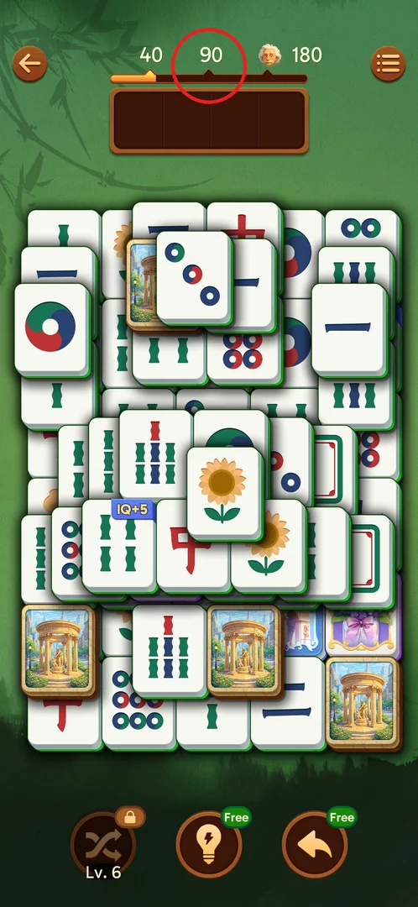
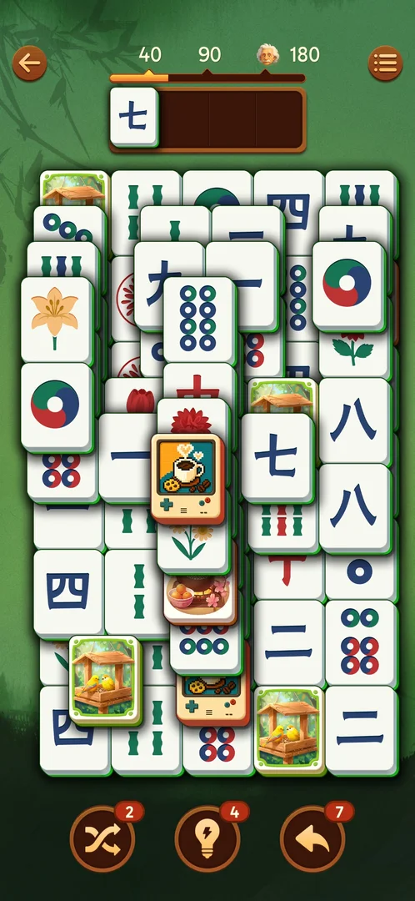
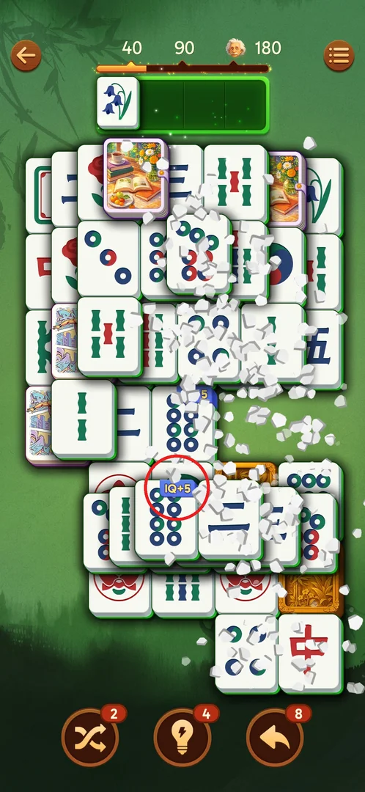

# IQ bar (40/90/180 milestones)

The IQ bar is the level's score: a bar at the top of the board that fills as you match pairs, with marks
at 40, 90 and 180 (an Einstein icon at 180) [^s1]. The IQ you end the level with is shown on the win screen
next to Time and Combo [^s6], and beating your best IQ is celebrated with a "New Record" overlay and a
crown [^s3] [^s5].

## Where to find it

Start any level: the bar is at the top of the board, between the back arrow and the menu button, right
above the 4-slot tray (circled) [^s1].

 [^s1]

## What it looks like

A thin dark bar with an orange fill that grows from the left. Above it are three marks: 40, 90 and 180,
with an Einstein portrait next to 180 [^s1]. Mid-level on level 8 the fill was past 40 and heading to 90
[^s2].

 [^s2]

## What you can do

The bar itself is not tappable; it reacts to what you do on the board.

| Tab or button | What it does |
|---|---|
| [New Record](#new-record) | An overlay mid-level when your IQ passes your best so far |
| [IQ+N badge](#iqn-badge) | A tile pair with an IQ+N badge: matching it adds about N IQ |

### New Record

When the IQ passes the best so far during a level, a crown and "IQ: New Record!" with the current value
(111.7 on level 2) appear over the board; play continues [^s3].

 [^s3]

### IQ+N badge

From level 7, one pair per board carries a blue "IQ+N" badge on both tiles (IQ+5 on level 7, IQ+10 on
level 8). Matching that pair moves the bar by about N IQ [^s7] [^s2]. Each match also shows a floating
"IQ+…" label [^s1].

 [^s4]

### Result

The win screen shows Time, IQ and Combo; a new best IQ gets a crown on the IQ box (level 2: IQ 122.2,
crown) [^s5].

 [^s5]

## How it works

Version 3.39.1.

- IQ grows with every matched pair; a normal pair moves the bar by about 1 IQ (measured on the bar, so
  approximate) [^s2].
- An IQ+N pair adds about N on top: IQ+5 ≈ +5, IQ+10 ≈ +10.5, measured as about 12 px and 27 px on a
  918-px frame, 2.56 px per IQ between the 40 and 90 marks [^s7] [^s2].
- Final IQ per level seen: level 1 — 111.3 (bar past 90, below 180) [^s6]; level 2 — 122.2 (record) [^s5];
  level 7 — 119.3; level 8 — 101.7 [^s8].
- Passing the best IQ shows the "New Record" overlay mid-level and a crown on the win screen [^s3] [^s5].

## Cases

| Case | What was done | Result | Source |
|---|---|---|---|
| Milestones | Won level 1 | Final IQ 111.3, bar past 90 but below 180; IQ shown on the win screen as the level score | [^s6] |
| Record | Played level 2 past the previous best | "IQ: New Record! 111.7" overlay mid-level; win screen IQ 122.2 with a crown | [^s3] [^s5] |
| IQ+N | Matched an IQ+5 pair (level 7) and an IQ+10 pair (level 8) | About +5 and +10.5 IQ; a normal pair about +1 | [^s7] [^s2] |

## Not verified

- What reaching the 40, 90 and 180 marks gives (a reward, a title on the win screen) — inferred to be
  milestones only, never checked.
- Whether the win-screen title ("Intelligent!", "Perceptive!") depends on the IQ.
- The exact IQ per normal pair: the values come from measuring the bar's fill, not from a counter.

[^s1]: session 20260930-211039-chrono-2FYKPJ, step 13
[^s2]: session 20260930-225122-chrono-2FYKPJ, step 24 — [video at 10:46](https://youtu.be/wSbzNbOhly8?t=646)
[^s3]: session 20260930-214524-chrono-2FYKPJ, step 85 — [video at 14:19](https://youtu.be/sWuok8myZrQ?t=859)
[^s4]: session 20260930-225122-chrono-2FYKPJ, step 8 — [video at 4:02](https://youtu.be/wSbzNbOhly8?t=242)
[^s5]: session 20260930-214524-chrono-2FYKPJ, step 96 — [video at 17:57](https://youtu.be/sWuok8myZrQ?t=1077)
[^s6]: session 20260930-211039-chrono-2FYKPJ, step 117
[^s7]: session 20260930-225122-chrono-2FYKPJ, step 9 — [video at 4:19](https://youtu.be/wSbzNbOhly8?t=259)
[^s8]: session 20260930-225122-chrono-2FYKPJ, step 76
