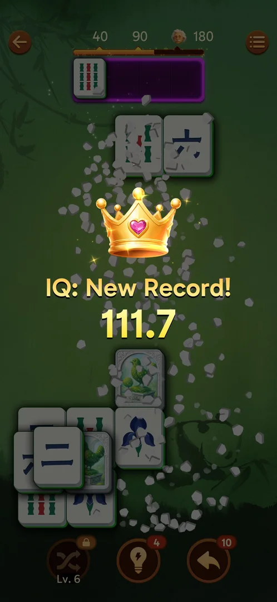

# IQ bar

A bar with marks at 40, 90 and 180 (an Einstein icon) fills as pairs are matched; the final IQ shows on
the win screen [s:20260930-211039-chrono-2FYKPJ#117]. Passing the best IQ mid-level shows "IQ: New Record!" [s:20260930-214524-chrono-2FYKPJ#85].

## Cases
| Case | What was done | Result | Source |
|---|---|---|---|
| Milestones | Won level 1 | IQ 111.3 | [s:20260930-211039-chrono-2FYKPJ#117] |
| Record | Level 2 | New Record overlay | [s:20260930-214524-chrono-2FYKPJ#85] |
| IQ+N | Matched IQ+5 and IQ+10 pairs | About +5 and +10.5 IQ; a normal pair about +1 | [s:20260930-225122-chrono-2FYKPJ#9] [s:20260930-225122-chrono-2FYKPJ#24] |
