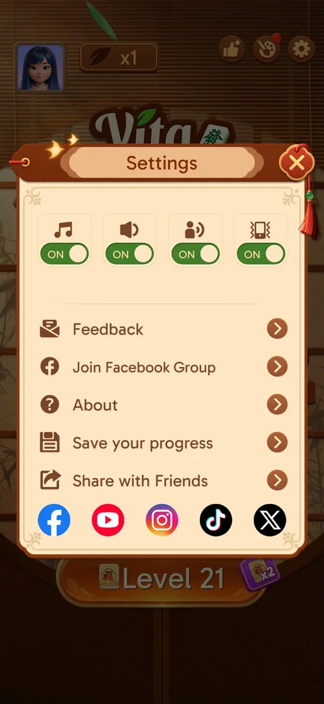
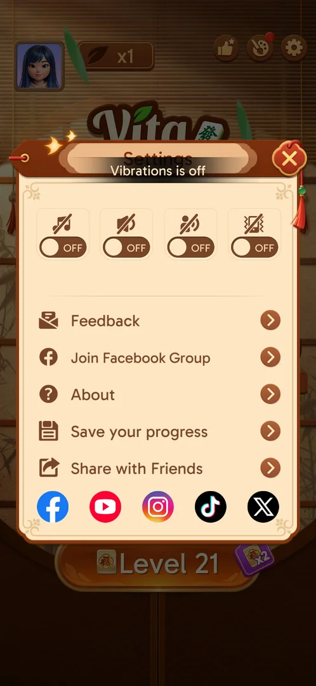

# Settings

The home screen's settings popup: four sound and vibration toggles, rows for feedback, the Facebook
group, About, saving progress and sharing, and five social-network icons [^s1] [^s2].

## Why it appeared

Open from the start: the gear button on the home screen [^s1].

## Where to find it

Home screen > the gear button in the top right corner [^s1].

 [^s1]
*The gear, top right of the home screen*

## What it looks like

 [^s2]
*Settings: toggles, five rows, five social icons*

## What you can do

| Tab or button | What it does |
|---|---|
| [Sound toggles](#sound-toggles) | Music, sound, voice, vibration on and off |
| [Feedback](#feedback) | The in-game help center "Vita Support" |
| [Join Facebook Group](#join-facebook-group) | Opens the group in the browser |
| [About](#about) | Version and the two legal documents |
| [Save your progress](#save-your-progress) | Facebook and Google sign-in |
| [Share with Friends](#share-with-friends) | The phone's share sheet |
| [Social icons](#social-icons) | Not tried |

### Sound toggles

 [^s4]
*The four toggles OFF, with the toast for the last one*

Music (a note), sound (a speaker), voice (a person speaking) and vibration (a phone), all ON at first.
Each was switched OFF: its icon gets a stroke through it; switching vibration OFF showed the toast
"Vibrations is off" [^s4]. All four were switched back ON [^s9]; the states were kept after Settings was
closed and opened again [^s7]. No toggle asks for a confirmation [^s8].

### Feedback

 [^s5]
*Feedback opens the in-game help center*

Feedback opens "Vita Support", a help center inside the game: an article search, article tabs (Popular
articles, Guidance, Ads Problem, User Feedback and more) and a "Chat with us" button. Its X top left
closes the help center and the Settings popup with it, back to the home screen [^s5] [^s10].

### Join Facebook Group

<!-- no-frame: it opens Chrome, another app -->
Opens the game's Facebook group in Chrome, outside the game; returning to the game finds Settings still
open [^s11] [^s8].

### About

 [^s3]
*Settings > About: version 3.40.1 and the two documents*

The app icon, the name and "Version 3.40.1"; rows for Terms of Service and Privacy Policy [^s3] [^s6].
Both rows open the document in Chrome, outside the game; returning to the game finds About still open
[^s12] [^s13].

### Save your progress

 [^s14]
*Settings > Save your progress*

Facebook and Google sign-in and a Delete Account link; see [Saved game sync](cloud-sync.md) [^s14].

### Share with Friends

<!-- no-frame: the share sheet is the phone's own screen, not the game's -->
Opens the phone's system share sheet; closing it returns to Settings [^s15].

### Social icons

<!-- no-frame: on the Settings frame above -->
Icons for Facebook, YouTube, Instagram, TikTok and X under the rows. None was tapped [^s2].

## How it works

Version 3.40.1 (shown in About) [^s3]. The same four toggles are in the level's Options, which adds the
game toggles and Restart (see [In-level Options](level-options.md)) [^s1].

## Cases

| Case | What was done | Result | Source |
|---|---|---|---|
| Gear button, home top right <!-- case:chk-entry --> | Tapped it | ✅ | [^s1] |
| Settings: music, sound, voice, vibration toggles; Feedback, Facebook Group, About, Save your progress, Share; social links <!-- case:chk-screen --> | Opened Settings | ✅ | [^s1] |
| Why it appeared: the trigger that brought it up (the first launch, a level won, a threshold, a timer, a loss): a fact with its frame, or a hypothesis to test <!-- case:chk-appeared --> | — | ✅ Open from the start | [^s1] |
| Every option or button and what it changes <!-- case:chk-options --> | Each toggle OFF and back ON; Settings closed and reopened | ✅ Toast "Vibrations is off"; the states are kept | [^s7] |
| Prompts and their answers <!-- case:chk-answers --> | Toggles, rows, X | ✅ No prompt in Settings; no confirmation on the toggles; Save your progress (sign-in, Start Over / Sync Data) is on its own page | [^s8] |
| Links out <!-- case:chk-links --> | Feedback, Join Facebook Group, Terms of Service, Privacy Policy, Share with Friends | ✅ Feedback: in-game Vita Support; Facebook group, Terms, Privacy: Chrome, the game comes back where it was; Share: the phone's share sheet | [^s8] |

## Not verified

- The five social icons (Facebook, YouTube, Instagram, TikTok, X): not tapped
- Chat with us in Vita Support: not tapped

[^s1]: session 20261003-195050-chrono-2FYKPJ, step 11 — [video at 3:09](https://youtu.be/KUKs3cQ-xqY?t=189)
[^s2]: session 20261006-071736-chrono-2FYKPJ, step 13 — [video at 2:12](https://youtu.be/E5MtJUwuItk?t=132)
[^s3]: session 20261003-195050-chrono-2FYKPJ, step 15 — [video at 3:56](https://youtu.be/KUKs3cQ-xqY?t=236)
[^s4]: session 20261006-071736-chrono-2FYKPJ, step 17 — [video at 2:34](https://youtu.be/E5MtJUwuItk?t=154)
[^s5]: session 20261006-071736-chrono-2FYKPJ, step 19 — [video at 2:49](https://youtu.be/E5MtJUwuItk?t=169)
[^s6]: session 20261006-071736-chrono-2FYKPJ, step 23 — [video at 4:19](https://youtu.be/E5MtJUwuItk?t=259)
[^s7]: session 20261006-071736-chrono-2FYKPJ, step 21 — [video at 3:06](https://youtu.be/E5MtJUwuItk?t=186)
[^s8]: session 20261006-071736-chrono-2FYKPJ, step 34 — [video at 5:50](https://youtu.be/E5MtJUwuItk?t=350)
[^s9]: session 20261006-071736-chrono-2FYKPJ, step 18 — [video at 2:46](https://youtu.be/E5MtJUwuItk?t=166)
[^s10]: session 20261006-071736-chrono-2FYKPJ, step 20 — [video at 2:59](https://youtu.be/E5MtJUwuItk?t=179)
[^s11]: session 20261006-071736-chrono-2FYKPJ, step 33 — [video at 5:35](https://youtu.be/E5MtJUwuItk?t=335)
[^s12]: session 20261006-071736-chrono-2FYKPJ, step 24 — [video at 4:27](https://youtu.be/E5MtJUwuItk?t=267)
[^s13]: session 20261006-071736-chrono-2FYKPJ, step 26 — [video at 4:47](https://youtu.be/E5MtJUwuItk?t=287)
[^s14]: session 20261003-195050-chrono-2FYKPJ, step 12 — [video at 3:23](https://youtu.be/KUKs3cQ-xqY?t=203)
[^s15]: session 20261006-071736-chrono-2FYKPJ, step 31 — [video at 5:22](https://youtu.be/E5MtJUwuItk?t=322)
