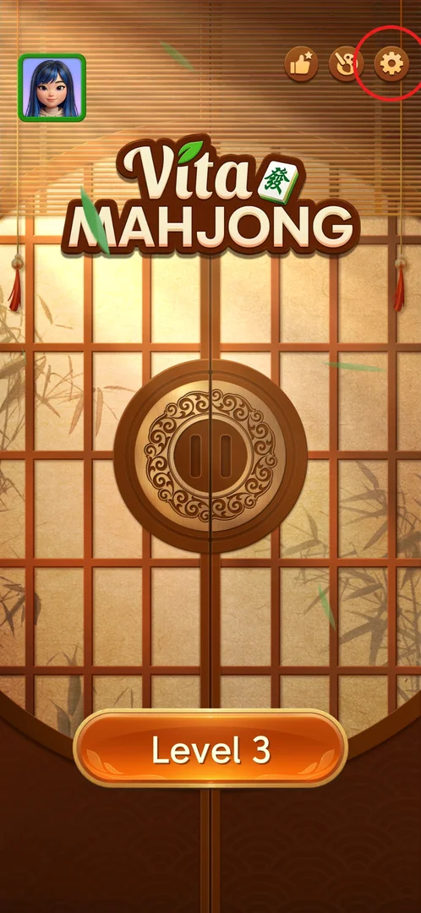
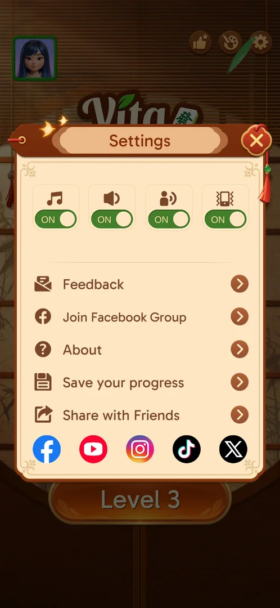
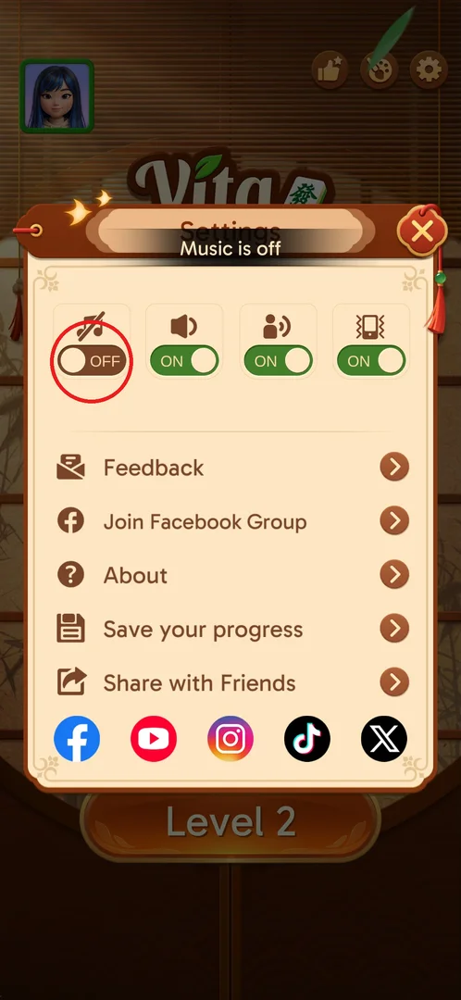
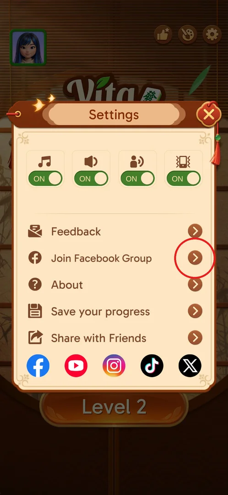
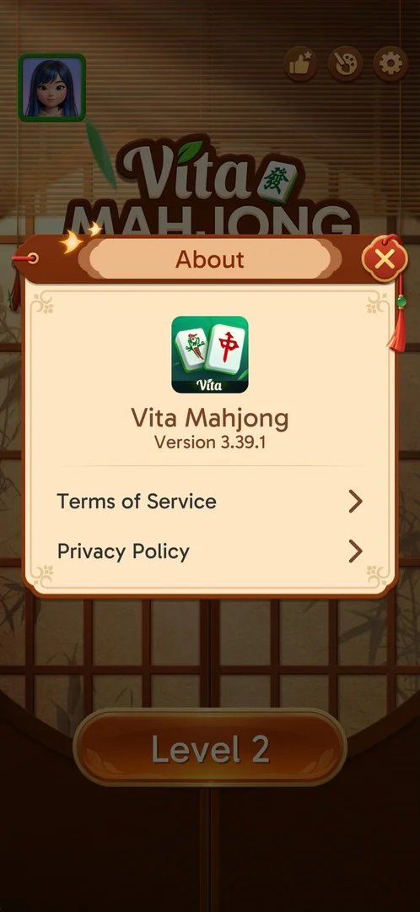
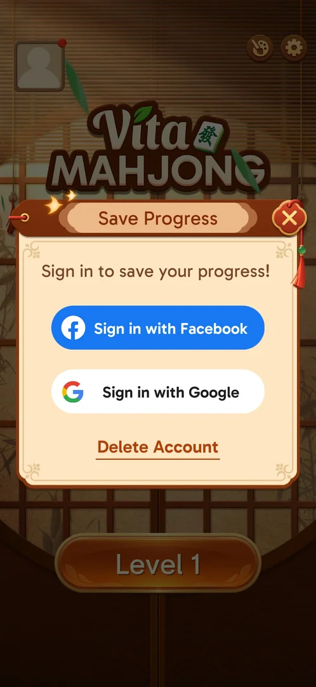
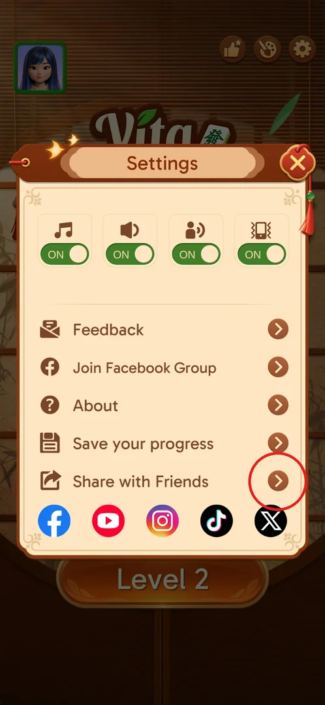

# Settings

The Settings popup is where the player turns music, sound, voice and vibration on or off, reads the game
version, links a Facebook or Google account to save progress, and reaches the game's feedback, Facebook
group and social pages. It has no language option [^s2]. It is available from the first launch [^s1].

## Where to find it

From the main screen: the gear, the rightmost round icon at the top right [^s1]. On a fresh install only two icons are there (palette and gear); by level 3 a thumbs-up
(achievements) has been added to their left [^s1] [^s10].

 [^s10]

## What it looks like

A popup titled "Settings" over the main screen with a red X at its top right. At the top, four toggles
with icons: music (note), sound (speaker), voice (speaking head) and vibration (phone), all ON by
default. Below, five rows with an arrow each: Feedback, Join Facebook Group, About, Save your progress,
Share with Friends. At the bottom, five social icons: Facebook, YouTube, Instagram, TikTok, X [^s1] [^s2].

 [^s2]

## What you can do

| Tab or button | What it does |
|---|---|
| [Sound toggles](#sound-toggles) | Music, sound, voice and vibration on or off, at once [^s8] |
| [Feedback](#feedback) | Leads outside the game (not opened) [^s9] |
| [Join Facebook Group](#join-facebook-group) | Leads outside the game (not opened) [^s9] |
| [About](#about) | Game version, Terms of Service and Privacy Policy [^s5] |
| [Save your progress](#save-your-progress) | Sign in with Facebook or Google; Delete Account [^s3] |
| [Share with Friends](#share-with-friends) | The Android share sheet with a promo text [^s9] |
| [Social icons](#social-icons) | Facebook, YouTube, Instagram, TikTok, X: lead outside the game (not opened) [^s9] |

### Sound toggles

Four switches: music, sound, voice, vibration. Tapping one flips it at once: OFF is brown with the
knob on the left, the icon gets crossed out, and a toast says so ("Music is off"); tapping again turns it
back ON (green) [^s4] [^s8]. Only music was toggled; whether the audio actually stops cannot be seen in
screenshots [^s8]. The in-level [Options](level-options.md) popup has the same four toggles [^s11].

 [^s4]

### Feedback

The first row. It leads outside the game and was not opened (the player does not switch apps) [^s9].

 [^s6]

### Join Facebook Group

The second row, with the Facebook logo. It leads outside the game and was not opened [^s9].

 [^s6]

### About

A popup "About": the app icon, "Vita Mahjong", "Version 3.39.1", and two rows, Terms of Service and
Privacy Policy (external web pages, not opened) [^s5]. Closing it with the red X returns to the main
screen [^s12].

 [^s5]

### Save your progress

A popup "Save Progress": "Sign in to save your progress!", the buttons Sign in with Facebook and Sign in
with Google, and an underlined Delete Account link. None of them was used (account changes are left to
a human) [^s3]. Closing it returns to the main screen, not to Settings [^s7].

 [^s3]

### Share with Friends

The last row. It opens the Android share sheet "Sharing text" with a short promo line that starts
"Match Mahjong tiles, unwind with ease!"; it was closed with Back and nothing was sent [^s9]. The share
sheet itself is not shown here because it lists the phone owner's contacts.

 [^s6]

### Social icons

Five icons along the bottom: Facebook, YouTube, Instagram, TikTok, X. They lead outside the game and
were not opened [^s1] [^s9].

 [^s6]

## How it works

- v3.39.1: all four toggles are ON on a fresh install [^s1].
- A toggle applies immediately; there is no Save button [^s8].
- A sub-popup (About, Save Progress) replaces Settings: closing it returns to the main screen, so
  Settings has to be opened again from the gear [^s7] [^s12].
- There is no language option [^s2].

## Cases

| Case | What was done | Result | Source |
|---|---|---|---|
| Open | Tapped the gear on the main screen | Settings: 4 toggles, 5 rows, 5 social icons; closing a sub-popup returns to the main screen, not Settings | [^s1] [^s7] |
| Music | Toggled off, then on | Flips at once: OFF brown with a crossed note and a "Music is off" toast, ON green | [^s4] [^s8] |
| About | Opened | "Vita Mahjong Version 3.39.1", Terms of Service and Privacy Policy links | [^s5] |
| Save progress | Opened | Sign in with Facebook or Google, Delete Account (not used) | [^s3] |
| Share | Opened | The Android share sheet with "Match Mahjong tiles, unwind with ease!"…; closed with Back, nothing sent | [^s9] |
| Feedback, Facebook group, social icons | Not opened | They lead outside the game | [^s9] |

## Not verified

- What Feedback, Join Facebook Group and the five social icons open (an email app, a browser, the
  social apps) [^s9].
- Whether the sound, voice and vibration toggles work like music, and whether the toggles are shared with
  the in-level Options popup (inferred from the identical toggles, not checked).
- Signing in with Facebook or Google and Delete Account: they change the account and are left to a human [^s3].
- The contents of Terms of Service and Privacy Policy [^s5].

[^s1]: session 20260930-203959-chrono-2FYKPJ, step 3 — [video at 1:03](https://youtu.be/2yK_ch59JAg?t=63)
[^s2]: session 20260930-221457-chrono-2FYKPJ, step 9
[^s3]: session 20260930-203959-chrono-2FYKPJ, step 4 — [video at 1:14](https://youtu.be/2yK_ch59JAg?t=74)
[^s4]: session 20260930-211039-chrono-2FYKPJ, step 121
[^s5]: session 20260930-211039-chrono-2FYKPJ, step 123
[^s6]: session 20260930-211039-chrono-2FYKPJ, step 125
[^s7]: session 20260930-203959-chrono-2FYKPJ, step 5 — [video at 1:28](https://youtu.be/2yK_ch59JAg?t=88)
[^s8]: session 20260930-211039-chrono-2FYKPJ, step 122
[^s9]: session 20260930-211039-chrono-2FYKPJ, step 127
[^s10]: session 20260930-221457-chrono-2FYKPJ, step 8
[^s11]: session 20260930-211039-chrono-2FYKPJ, step 133
[^s12]: session 20260930-211039-chrono-2FYKPJ, step 124
