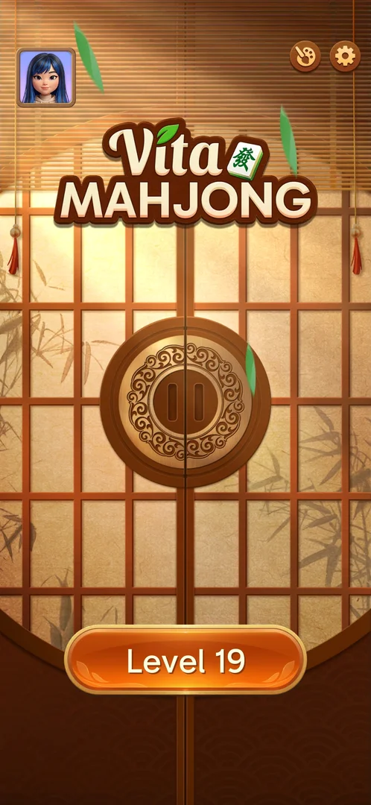
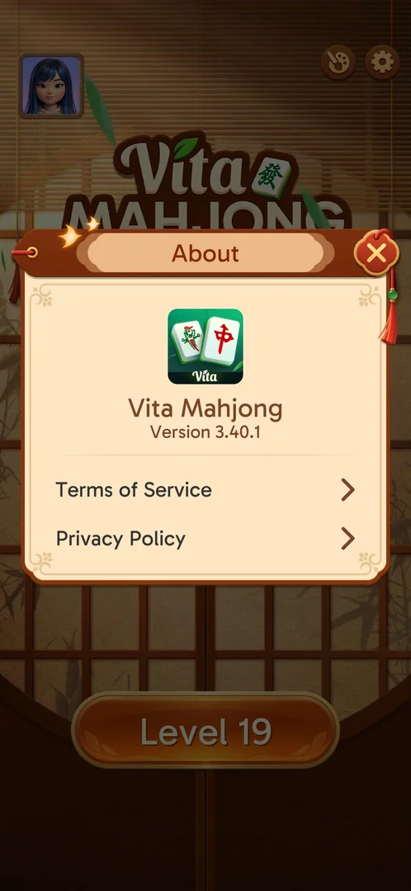

# Settings

The home screen's settings popup: four sound and vibration toggles, rows for feedback, the Facebook
group, About, saving progress and sharing, and five social-network icons [^s1].

## Why it appeared

Open from the start: the gear button on the home screen [^s1].

## Where to find it

Home screen > the gear button in the top right corner [^s1].

 [^s1]
*The gear, top right of the home screen*

## What it looks like

 [^s1]
*Settings: toggles, five rows, five social icons*

## What you can do

| Tab or button | What it does |
|---|---|
| [Sound toggles](#sound-toggles) | Music, sound, voice, vibration |
| [About](#about) | Version and the two legal documents |
| [Save your progress](#save-your-progress) | Facebook and Google sign-in |
| [Other rows and icons](#other-rows-and-icons) | Feedback, Facebook group, sharing, social links; not tried |

### Sound toggles

<!-- no-frame: on the Settings frame above -->
Music (a note), sound (a speaker), voice (a person speaking) and vibration (a phone); all ON. Not
switched [^s1].

### About

 [^s2]
*Settings > About: version 3.40.1 and the two documents*

The app icon, the name and "Version 3.40.1"; rows for Terms of Service and Privacy Policy (not tapped)
[^s2].

### Save your progress

 [^s3]
*Settings > Save your progress*

Facebook and Google sign-in and a Delete Account link; see [Saved game sync](cloud-sync.md) [^s3].

### Other rows and icons

<!-- no-frame: on the Settings frame above -->
Feedback, Join Facebook Group, Share with Friends and the icons for Facebook, YouTube, Instagram, TikTok
and X lead out of the game (inferred from their names); none was tapped [^s1].

## How it works

Version 3.40.1 (shown in About) [^s2]. The same four toggles are in the level's Options, which adds the
game toggles and Restart (see [In-level Options](level-options.md)) [^s1].

## Cases

| Case | What was done | Result | Source |
|---|---|---|---|
| Gear button, home top right <!-- case:chk-entry --> | Tapped it | ✅ | [^s1] |
| Settings: music, sound, voice, vibration toggles; Feedback, Facebook Group, About, Save your progress, Share; social links <!-- case:chk-screen --> | Opened Settings | ✅ | [^s1] |
| Why it appeared: the trigger that brought it up (the first launch, a level won, a threshold, a timer, a loss): a fact with its frame, or a hypothesis to test <!-- case:chk-appeared --> | — | ✅ Open from the start | [^s1] |
| Every option or button and what it changes (each toggle once, set back after) <!-- case:chk-options --> | Opened About and Save your progress | partly: those two; toggles, Feedback and Share not tried | [^s2] |
| For a prompt (consent, rate us, notifications): what each answer does and whether it comes back <!-- case:chk-answers --> | — | does not apply: not a prompt |  |
| Links out (privacy, terms, help): where they lead (back to the game at once) <!-- case:chk-links --> | — | not verified: no link tapped |  |

## Not verified

- Every option: the toggles, Feedback, Share with Friends <!-- case:chk-options -->
- Links out: Terms of Service, Privacy Policy, Facebook group, the social icons <!-- case:chk-links -->

[^s1]: session 20261003-195050-chrono-2FYKPJ, step 11 — [video at 3:13](https://youtu.be/KUKs3cQ-xqY?t=193)
[^s2]: session 20261003-195050-chrono-2FYKPJ, step 15 — [video at 4:00](https://youtu.be/KUKs3cQ-xqY?t=240)
[^s3]: session 20261003-195050-chrono-2FYKPJ, step 12 — [video at 3:27](https://youtu.be/KUKs3cQ-xqY?t=207)
