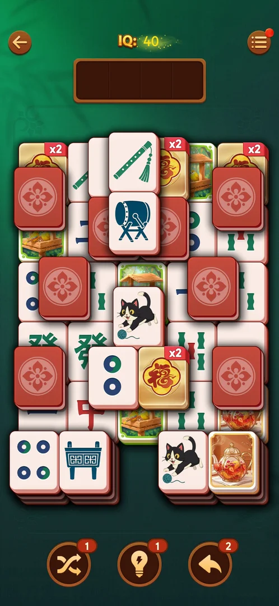

# Spinning tiles

A level element announced on level 21: the level opens with a banner "Clear every tile to stop the
spin!" over a small picture of a 3 by 3 block of tiles with two circular arrows [^s1].
The level was left before any move, so how the spin looks and works on the board was not seen.

## Why it appeared

The intro banner came up on the first open of level 21, the first level after the Hard level 20
[^s1].

## Where to find it

Home screen > the orange "Level 21" button at the bottom (not Hard; it carries a purple "x2" tag with a 福
tile) [^s2].

 [^s2]
*The "Level 21" button opens the first level with spinning tiles*

## What it looks like

 [^s1]
*The banner level 21 opens with*

 [^s1]
*The board after the banner: no tile was seen moving*

- The level has no Hard mark: the normal header with IQ 40 [^s1].
- The board uses the red tile set with red face-down backs (see [Face-down tiles](face-down-tiles.md));
  the gold 福 tiles carry a red "x2" badge, the same x2 as on the Level 21 button
  [^s1] (see [Leagues](leagues.md)).
- Which tiles spin was not visible on the still frame [^s1].

## How it works

Version 3.40.1. Not seen: the level was left with the back arrow right after the banner
[^s2]. From the banner text only: the spin goes on until every tile is
cleared. Hypothesis: a group of tiles on the board rotates its positions, as the 3 by 3 picture with arrows
suggests; not verified.

## Outcomes

<!-- the map has no under-<outcome> cases for this feature yet -->

| Outcome | As the base or what differs | Frame |
|---|---|---|
| Win, Out of space, Restart, exit the app | not verified: no move was made on level 21 | — |
| Quit with the back arrow | As the base: back to the home screen with no confirmation [^s2] | — |

## Cases

| Case | What was done | Result | Source |
|---|---|---|---|
| Why it appeared <!-- case:chk-appeared --> | Opened level 21 after winning the Hard level 20 | ✅ The banner "Clear every tile to stop the spin!" | [^s1] |
| Where to find it <!-- case:chk-entry --> | Opened level 21 from the win screen | Seen: the Level 21 button; still open in the map | [^s2] |
| What it looks like <!-- case:chk-screen --> | — | Seen: the banner and the still board; still open in the map | [^s1] |
| The first level it shows on and how the game introduces it <!-- case:chk-first-level --> | — | not verified: level 21 with an intro banner; whether earlier levels had it not known | |
| What it does and how it is used <!-- case:chk-rules --> | — | not verified | |
| How it interacts with the other pieces <!-- case:chk-interactions --> | — | not verified | |
| Whether it adds a way to lose <!-- case:chk-loss --> | — | not verified | |

## Not verified

- Where to find it: the Level 21 button (seen, not closed in the map) <!-- case:chk-entry -->
- What it looks like: the board in motion <!-- case:chk-screen -->
- The first level it shows on: level 21 is the first seen <!-- case:chk-first-level -->
- What spins, when, and what stops it <!-- case:chk-rules -->
- How spinning tiles meet face-down tiles, the x2 福 tiles and the boosters <!-- case:chk-interactions -->
- Whether the spin adds a way to lose <!-- case:chk-loss -->

[^s1]: session 20261005-133525-chrono-2FYKPJ, step 48 — [video at 19:04](https://youtu.be/D10jI230Oks?t=1144)
[^s2]: session 20261005-133525-chrono-2FYKPJ, step 49 — [video at 19:53](https://youtu.be/D10jI230Oks?t=1193)
