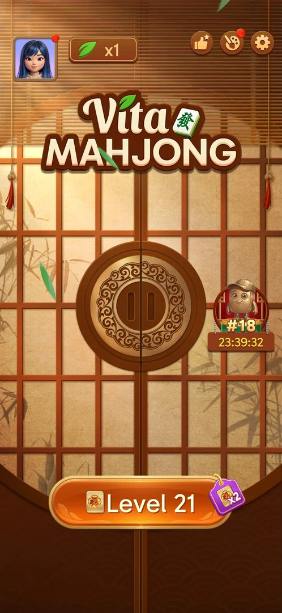
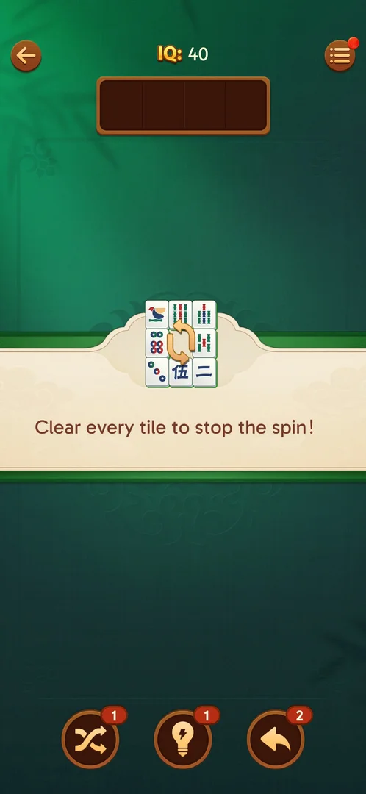
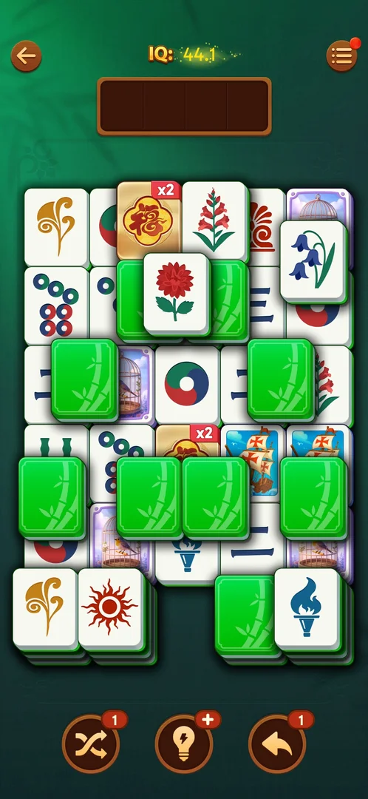
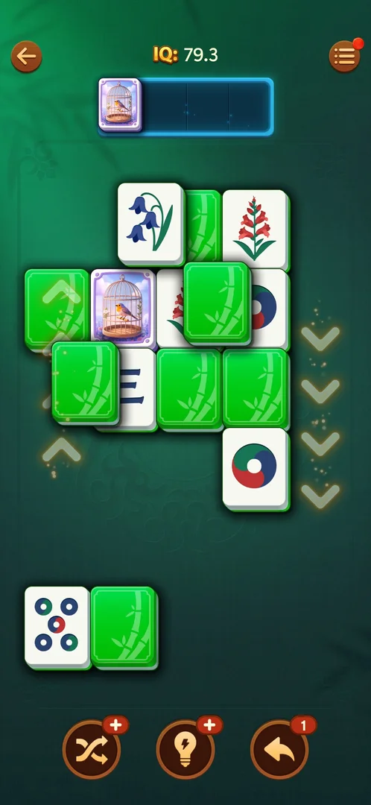
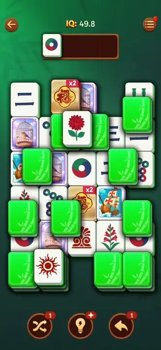
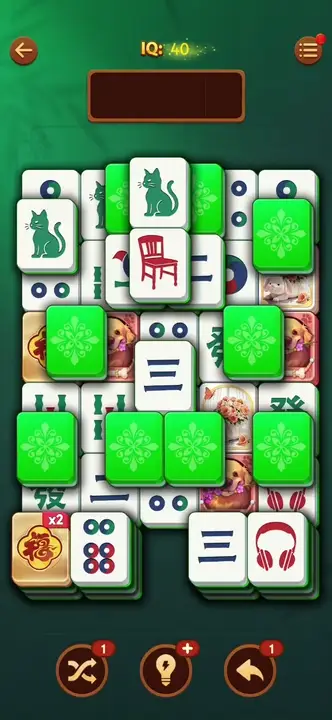

# Spinning tiles

A level element announced on level 21: the level opens with a banner "Clear every tile to stop the
spin!" over a small picture of a 3 by 3 block of tiles with two circular arrows [^s1]. On the board, a
ring of lower-layer tiles along the board's edge (the top row, both side columns and the bottom row)
turns one place clockwise every time a tile leaves the board; faint yellow chevrons on the ring show
the direction [^s9] [^s8]. The tiles on top of the ring and the two stacks at the bottom do not move
[^s9]. The ring keeps turning until the board is cleared [^s11].

## Why it appeared

The intro banner came up on the first open of level 21, the first level after the Hard level 20
[^s1].

## Where to find it

Home screen > the orange "Level 21" button at the bottom (not Hard; it carries a purple "x2" tag with a 福
tile) [^s5]. There is no separate entry: the element is on the level board [^s1].

 [^s5]
*The "Level 21" button opens the first level with spinning tiles*

## What it looks like

 [^s1]
*The banner level 21 opens with*

 [^s7]
*Level 21: the ring is the outer frame of lower-layer tiles; the green backs and the tiles in the middle lie on top of it*

- The level has no Hard mark: the normal header with IQ 40 [^s1].
- The ring tiles are ordinary tiles: symbol tiles, picture tiles, gold 福 x2 tiles and face-down backs
  all ride on it [^s10]. Nothing marks a tile as a ring tile except its place on the edge [^s7].
- The green tiles with a medallion seen on earlier runs of level 21 (yellow with a gold medallion in one
  run [^s3], green with a light medallion in another [^s2]) are face-down tiles: a tap turned one over
  in place to a cat face [^s6] (see [Face-down tiles](face-down-tiles.md)). In this session the backs were
  green with a bamboo pattern [^s7]. Inferred: the back follows the tile set in use.
- The gold 福 tiles carry a red "x2" badge, the same x2 as on the Level 21 button [^s1] (see
  [Leagues](leagues.md)).

## What you can do

| Tab or button | What it does |
|---|---|
| [Direction chevrons](#direction-chevrons) | Show which way the ring turns |

### Direction chevrons

 [^s8]
*The direction chevrons: up on the left side, down on the right side, so the ring turns clockwise*

The chevrons light up on the ring while it turns and are not tapped: up along the left side, down along
the right side [^s8] [^s9]. The player acts on the ring only by taking tiles off the board.

## How it works

Version 3.40.1.

- **What turns the ring.** Every tile taken from the board into the tray, a single or one of a pair,
  turns the ring one place clockwise: the left column moves up, the top row moves right, the right
  column moves down, the bottom row moves left [^s9]. A face-down tile flipped and cleared with its
  face-up twin (no tray slot) turns it too [^s10].
- **What does not.** Turning a face-down tile over moves nothing; a tap on a locked tile moves nothing
  [^s9] [^s8].
- **What stays.** The tiles in the layer above the ring and the two stacks at the bottom never move
  [^s9] [^s10].
- **Timing.** The ring turns after the move, not on a timer: about 25 s idle showed no movement [^s2]
  [^s9]. A tap sent while the ring turns lands on whatever has moved under that point: in one batch two
  later taps were lost [^s10].
- **Shuffle.** The Shuffle booster re-deals the ring tiles together with the rest of the board [^s10].

 [^s12]
*Clip 5.6 s · [original on YouTube from 7:49](https://youtu.be/lmyXziDOcNk?t=469)*

In an earlier session the same turn was read as tiles changing faces in place: after one matched pair
the top left corner (a circles tile) showed a gold 福 x2 tile, the top right corner a dog picture, the
rabbit picture and the right dog became circles tiles, while the face-down tiles, the chair, the centre
三 tile and the two bottom stacks stayed [^s4]. Inferred: those were the ring tiles moving along by
the two tiles that left the board.

 [^s4]
*Clip 6.5 s · [original on YouTube from 7:21](https://youtu.be/E5MtJUwuItk?t=441)*

## Outcomes

<!-- the map has no under-<outcome> cases for this feature yet -->

| Outcome | As the base or what differs | Frame |
|---|---|---|
| Win | As the base: the ring turned to the end and stopped when the board was cleared; then the league standing, the notification notice, Daily Victories, Rate Us and the win screen [^s11] | — |
| Out of space | No new way to lose: the ring only moves tiles; the tray works as on other levels. Out of space was not reached on level 21 [^s11] | — |
| Restart, exit the app | not verified | — |
| Quit with the back arrow | As the base: back to the home screen with no confirmation [^s5] | — |

## Cases

| Case | What was done | Result | Source |
|---|---|---|---|
| Why it appeared <!-- case:chk-appeared --> | Opened level 21 after winning the Hard level 20 | ✅ The banner "Clear every tile to stop the spin!" | [^s1] |
| The first level it shows on <!-- case:chk-first-level --> | Opened level 21, the first after the Hard level 20 | ✅ Level 21, with the intro banner | [^s1] |
| Where to find it <!-- case:chk-entry --> | Opened level 21 from the Level button | ✅ On the level board itself; no separate entry | [^s1] |
| What it looks like <!-- case:chk-screen --> | Looked at the level 21 board | ✅ Ordinary tiles; medallion tiles among them (later found to be face-down backs) | [^s3] |
| What it does and how it is used <!-- case:chk-rules --> | Took single tiles and pairs into the tray, flipped face-down tiles, tapped locked tiles | ✅ The edge ring turns one place clockwise per tile taken into the tray; flips and locked taps move nothing; chevrons show the direction; top-layer tiles and the bottom stacks stay | [^s9] |
| The board after a match <!-- case:after-match-rearrange --> | Matched two cats on level 21 | ✅ Edge tiles showed other faces after the match; the face-down tiles, the chair, the centre 三 and the bottom stacks stayed (inferred: the ring turning) | [^s4] |
| How it interacts with the other pieces <!-- case:chk-interactions --> | Played level 21 to the end with face-down, picture and x2 tiles; used Shuffle | ✅ The ring carries every kind of tile; a flip-and-twin clear turns it; Shuffle re-deals the ring tiles; taps during a turn land on the moved tile | [^s10] |
| Whether it adds a way to lose <!-- case:chk-loss --> | Won level 21 with the ring turning | ✅ No new way to lose; the spin stops when the board is cleared | [^s11] |

## Not verified

- Restart and exiting the app on a spinning board (no map case yet)
- Whether a level after 21 has more than one ring or a counter-clockwise ring

[^s1]: session 20261005-133525-chrono-2FYKPJ, step 48 — [video at 19:41](https://youtu.be/D10jI230Oks?t=1181)
[^s2]: session 20261006-071736-chrono-2FYKPJ, step 36 — [video at 6:15](https://youtu.be/E5MtJUwuItk?t=375)
[^s3]: session 20261006-044557-chrono-2FYKPJ, step 1 — [video at 0:35](https://youtu.be/zbXLEc-sGlk?t=35)
[^s4]: session 20261006-071736-chrono-2FYKPJ, step 38 — [video at 7:27](https://youtu.be/E5MtJUwuItk?t=447)
[^s5]: session 20261005-133525-chrono-2FYKPJ, step 49 — [video at 20:30](https://youtu.be/D10jI230Oks?t=1230)
[^s6]: session 20261006-071736-chrono-2FYKPJ, step 37 — [video at 6:53](https://youtu.be/E5MtJUwuItk?t=413)
[^s7]: session 20261006-072809-chrono-2FYKPJ, step 10 — [video at 4:53](https://youtu.be/lmyXziDOcNk?t=293)
[^s8]: session 20261006-072809-chrono-2FYKPJ, step 37 — [video at 16:04](https://youtu.be/lmyXziDOcNk?t=964)
[^s9]: session 20261006-072809-chrono-2FYKPJ, step 13 — [video at 6:16](https://youtu.be/lmyXziDOcNk?t=376)
[^s10]: session 20261006-072809-chrono-2FYKPJ, step 39 — [video at 16:44](https://youtu.be/lmyXziDOcNk?t=1004)
[^s11]: session 20261006-072809-chrono-2FYKPJ, step 55 — [video at 23:08](https://youtu.be/lmyXziDOcNk?t=1388)
[^s12]: session 20261006-072809-chrono-2FYKPJ, step 14 — [video at 7:54](https://youtu.be/lmyXziDOcNk?t=474)
