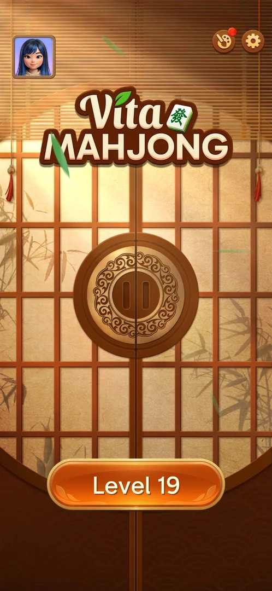
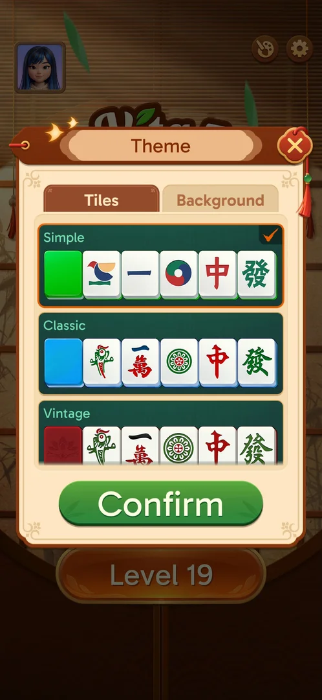
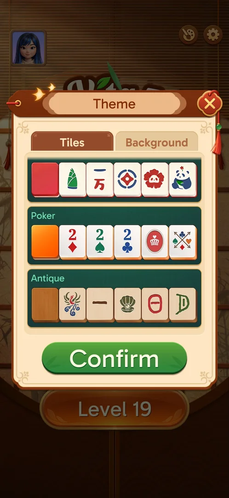
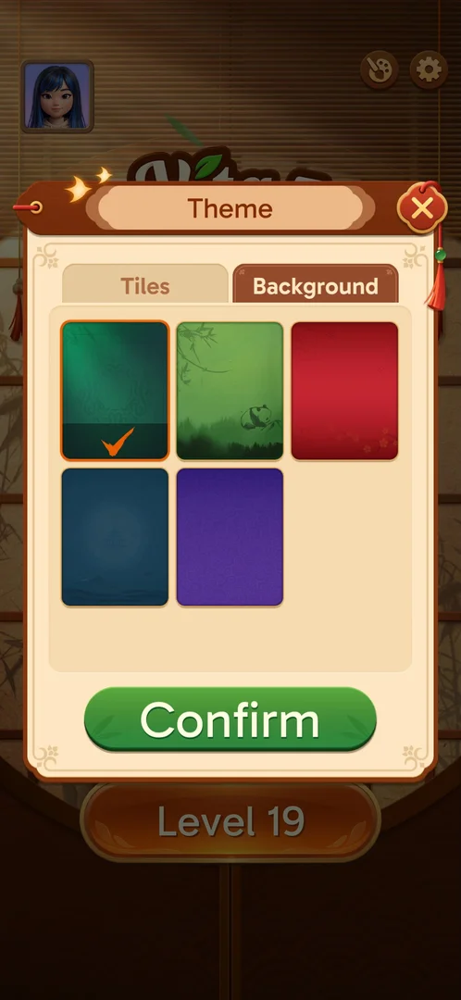
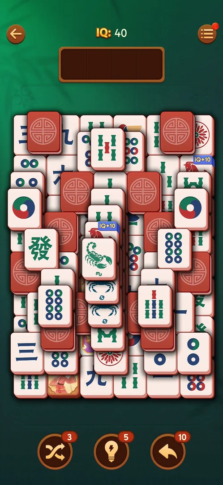

# Theme (tiles and background)

A popup for the look of the board: a Tiles tab of six tile sets and a Background tab of five
backgrounds. All of them were free at level 19: no locks and no prices [^s1] [^s2] [^s3].

## Why it appeared

Open from the start: the palette button on the home screen. It showed a red dot after the save sync
[^s1].

## Where to find it

Home screen > the palette button in the top right corner, left of the gear [^s1]. It is also a row in the
level's Options (see [In-level Options](level-options.md)).

 [^s1]
*The palette button (red dot), left of the gear*

## What it looks like

 [^s1]
*Theme, Tiles tab: each set is a swatch of its colour and five sample tiles; the current set is checked*

Two tabs (Tiles, Background), a scrolling list, a green Confirm button and a close X [^s1].

## What you can do

| Tab or button | What it does |
|---|---|
| [Tiles](#tiles) | Pick a tile set |
| [Background](#background) | Pick a background |
| [Confirm](#confirm) | Applies the choice; not tapped |

### Tiles

 [^s2]
*The end of the Tiles list: the panda set, Poker, Antique*

Six sets, top to bottom [^s1] [^s2]:

| Set | Swatch | Faces |
|---|---|---|
| Simple (in use) | green | simplified symbols |
| Classic | blue | traditional mahjong faces |
| Vintage | red | traditional faces |
| (no name seen) | red | bamboo, characters, a panda |
| Poker | orange | playing-card ranks and suits |
| Antique | wood | carved-style symbols |

### Background

 [^s3]
*Background: five choices, the green one in use*

Five backgrounds: green (in use), a bamboo forest with a panda, red, dark blue, purple [^s3].

### Confirm

<!-- no-frame: the button is on the frames above -->
Not tapped: the popup was closed with the X without changes [^s4].

## How it works

Version 3.40.1. At level 19 every tile set and every background was free, with no lock, level or price
shown [^s2] [^s3]. The tile set in use (Simple) is the one on the level board (see
[Tray mahjong level](core-level.md)) [^s1].

The level 19 board looked different in two sessions with no theme change in between: purple tile backs
in the first, red tile backs with other picture tiles in a later one, after the game had reopened at
Level 1 and the save had been restored [^s5]. Inferred: the restore or the reset changed the tile set
or the board's art; not verified.

 [^s5]
*Level 19 after the restore: red tile backs (the first session had purple ones)*

## Cases

| Case | What was done | Result | Source |
|---|---|---|---|
| Palette button, home top right next to the gear <!-- case:chk-entry --> | Tapped it | ✅ | [^s1] |
| Theme popup: Tiles tab (6 sets, all free) and Background tab (5, all free), Confirm <!-- case:chk-screen --> | Opened both tabs, scrolled the tile sets | ✅ | [^s3] |
| Why it appeared: the trigger that brought it up (the first launch, a level won, a threshold, a timer, a loss): a fact with its frame, or a hypothesis to test <!-- case:chk-appeared --> | — | ✅ Open from the start | [^s1] |
| Every option or button and what it changes (each toggle once, set back after) <!-- case:chk-options --> | Closed with the X | partly: no set or background applied | [^s4] |
| The level board's tiles after a reset and restore <!-- case:board-set-changed --> | Opened level 19 after Start Over > No restored the save | ✅ Red tile backs with zodiac and picture tiles; the session before had purple backs; no theme change was made | [^s5] |
| For a prompt (consent, rate us, notifications): what each answer does and whether it comes back <!-- case:chk-answers --> | — | does not apply: not a prompt |  |
| Links out (privacy, terms, help): where they lead (back to the game at once) <!-- case:chk-links --> | — | does not apply: no links | [^s1] |

## Not verified

- Every option: applying another tile set or background, and what the palette's red dot pointed to <!-- case:chk-options -->
- Why the level 19 board changed from purple to red tile backs between sessions

[^s1]: session 20261003-195050-chrono-2FYKPJ, step 7 — [video at 2:26](https://youtu.be/KUKs3cQ-xqY?t=146)
[^s2]: session 20261003-195050-chrono-2FYKPJ, step 8 — [video at 2:43](https://youtu.be/KUKs3cQ-xqY?t=163)
[^s3]: session 20261003-195050-chrono-2FYKPJ, step 9 — [video at 2:55](https://youtu.be/KUKs3cQ-xqY?t=175)
[^s4]: session 20261003-195050-chrono-2FYKPJ, step 10 — [video at 3:07](https://youtu.be/KUKs3cQ-xqY?t=187)
[^s5]: session 20261003-231804-chrono-2FYKPJ, step 4 — [video at 1:11](https://youtu.be/ssTmhwls_uc?t=71)
