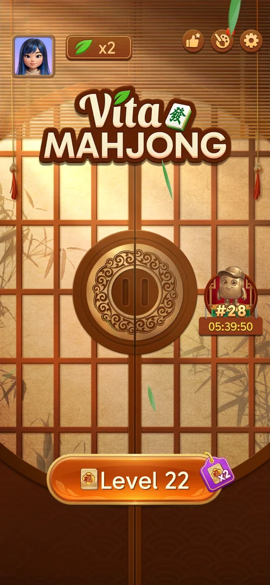
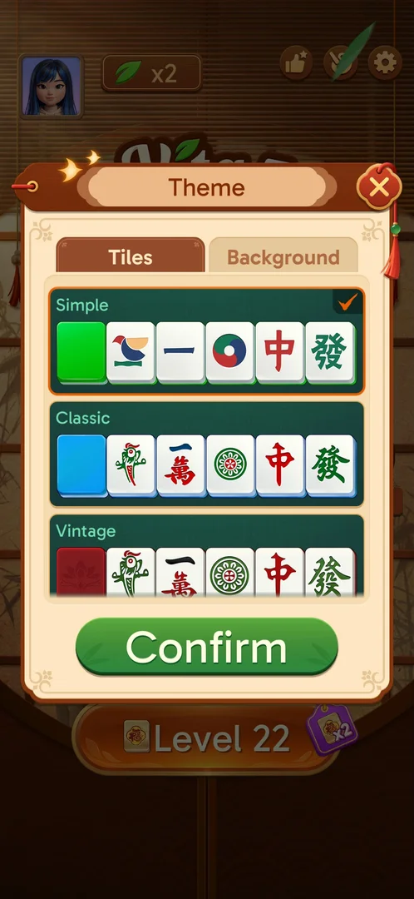
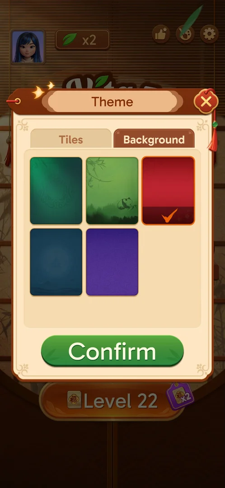
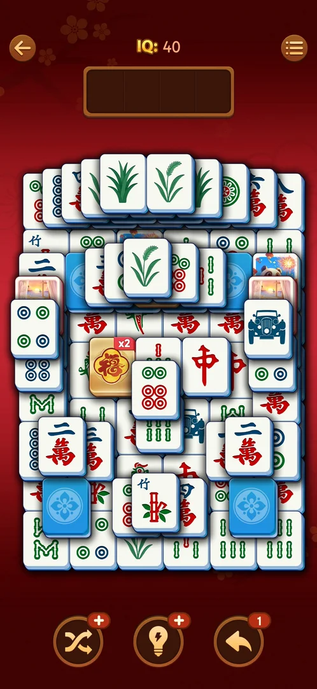
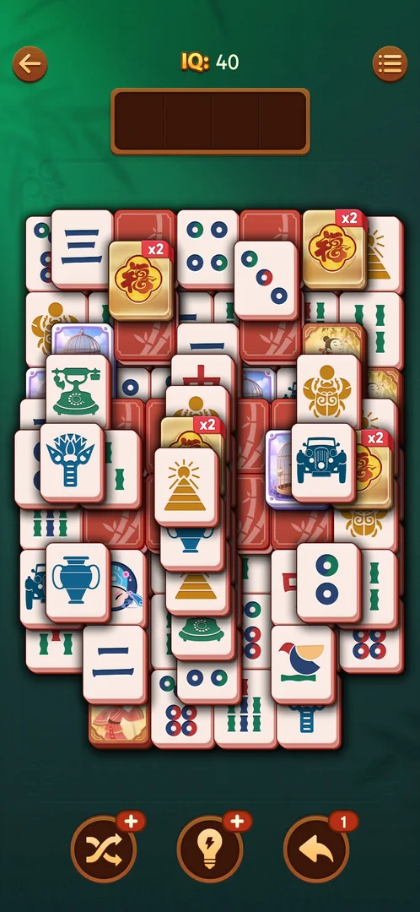

# Theme (tiles and background)

A popup for the look of the level board: a Tiles tab of six tile sets and a Background tab of five
backgrounds, applied together with Confirm. All of them were free at levels 19 and 22: no locks and no
prices [^s1] [^s2] [^s3]. A confirmed pick changes the level board, not the home screen [^s10].

## Why it appeared

Open from the start; palette button on the home screen, red dot shown after the save sync [^s1].

## Where to find it

Home screen > the palette button in the top right corner, left of the gear [^s1]. It is also a row in the
level's Options (see [In-level Options](level-options.md)).

 [^s1]
*The palette button (red dot), left of the gear*

 [^s6]
*Since the Rate us button appeared, the palette sits between it and the gear*

## What it looks like

 [^s1]
*Theme, Tiles tab: each set is a swatch of its back colour and five sample tiles; the current set is checked*

Two tabs (Tiles, Background), a scrolling list, a green Confirm button and a close X [^s1]. The checked
set or background has an orange frame and an orange tick [^s11] [^s12].

## What you can do

| Tab or button | What it does |
|---|---|
| [Tiles](#tiles) | Pick a tile set |
| [Background](#background) | Pick a background |
| [Confirm](#confirm) | Applies the picks of both tabs to the level board |
| [Close X](#close-x) | Closes the popup; an unconfirmed pick is dropped |

### Tiles

 [^s7]
*The top of the Tiles list: Simple checked at level 22*

 [^s2]
*The end of the Tiles list: the panda set, Poker, Antique*

Six sets, top to bottom [^s1] [^s2]:

| Set | Swatch | Faces |
|---|---|---|
| Simple (in use by default) | green | simplified symbols |
| Classic | blue | traditional mahjong faces |
| Vintage | red | traditional faces |
| (no name seen) | red | bamboo, characters, a panda |
| Poker | orange | playing-card ranks and suits |
| Antique | wood | carved-style symbols |

A tap on a set moves the tick to it at once; nothing is applied until Confirm [^s11] [^s10].

### Background

 [^s12]
*Background: five choices, the red one picked before Confirm*

Five backgrounds: dark green (in use by default), a bamboo forest with a panda, red, dark blue,
purple; the same list at level 19 and at level 22 [^s3] [^s8]. A pick on the Tiles tab is kept while
switching to this tab [^s12].

### Confirm

 [^s13]
*Level 22 after Confirm with Classic + red: white and blue tiles on a red table*

Confirm with Classic and the red background closed the popup; the home screen looked the same as
before. The next level 22 board had white faces with blue sides, blue backs with a white flower and a
red plum-blossom background [^s10] [^s13].

### Close X

<!-- no-frame: the X is on the frames above -->
Classic was checked and the popup closed with the X; when it was opened again, Simple was still checked:
the X drops an unconfirmed pick [^s4] [^s14].

## How it works

Version 3.40.1.

- Every tile set and every background was free, with no lock, level or price shown, at level 19 and at
  level 22 [^s2] [^s3] [^s12].
- Confirm applies the tile set and the background together, to the level board only [^s10] [^s13].
- A confirmed pick was not kept across a force-stop and relaunch: the popup showed Simple and dark green
  checked again [^s15]. The next level 22 board had the dark green background, matching the picker, but
  red-sided tiles with red backs (a bamboo pattern on the backs), not the green backs of Simple [^s16].
  The board's tile set did not follow the picker after the relaunch. The palette button had its red dot
  again on the home screen after the relaunch; it had none right after Confirm [^s10] [^s17].

 [^s16]
*Level 22 after a relaunch: the picker says Simple, the board has red-back tiles on dark green*

- Earlier, the level 19 board looked different in two sessions with no theme change in between: purple
  tile backs in the first, red tile backs with other picture tiles in a later one, after the game had
  reopened at Level 1 and the save had been restored [^s5]. Inferred: the drift of the board's tile set
  between launches is at least partly the relaunch behaviour above; not verified.

 [^s5]
*Level 19 after the restore: red tile backs (the first session had purple ones)*

- On 2026-10-06, before any pick, the popup showed Simple and dark green and the level 21 and 22 boards
  had green face-down backs on a dark green table [^s9] (see [Spinning tiles](spin-tiles.md)).

## Cases

| Case | What was done | Result | Source |
|---|---|---|---|
| Palette button, home top right next to the gear <!-- case:chk-entry --> | Tapped it | ✅ | [^s1] |
| Theme popup: Tiles tab (6 sets, all free) and Background tab (5, all free), Confirm <!-- case:chk-screen --> | Opened both tabs, scrolled the tile sets | ✅ | [^s3] |
| Why it appeared <!-- case:chk-appeared --> | — | ✅ Open from the start | [^s1] |
| Every option or button and what it changes <!-- case:chk-options --> | Picked Classic and the red background, Confirm, opened level 22; earlier picked Classic and closed with the X | ✅ Confirm applies both to the board (white/blue tiles on red); the home screen does not change; the X drops the pick | [^s10] [^s13] |
| Close X drops an unconfirmed pick <!-- case:x-discards --> | Checked Classic, closed with the X, reopened | ✅ Simple still checked | [^s14] |
| A confirmed pick after a force-stop relaunch <!-- case:pick-not-kept-on-relaunch --> | Confirmed Classic + red, force-stopped and relaunched, opened Theme and level 22 | ✅ Picker back to Simple + dark green; the board had a dark green table but red-back tiles | [^s15] [^s16] |
| The level board's tiles after a reset and restore <!-- case:board-set-changed --> | Opened level 19 after Start Over > No restored the save | ✅ Red tile backs with zodiac and picture tiles; the session before had purple backs; no theme change was made | [^s5] |
| What each answer of a prompt does <!-- case:chk-answers --> | — | ✅ does not apply: a picker, not a prompt | [^s9] |
| The board against the selected theme on 2026-10-06 <!-- case:simple-matches-board --> | Opened Theme after the level 21 win; looked at both tabs; closed with the X | ✅ Simple and dark green selected; the level 21 and 22 boards had green backs on dark green | [^s9] |
| Links out <!-- case:chk-links --> | — | ✅ none: two tabs, the set and background cards, Confirm and the X | [^s9] |

## Not verified

- Whether a confirmed pick is kept when the game is left with Android Home (no force-stop) and resumed
- Which tile set the red-back board after the relaunch is, and why the board's tile set differs from the picker then
- Poker, Antique, Vintage, the unnamed panda set and the other backgrounds were not applied
- What the palette's red dot points to

[^s1]: session 20261003-195050-chrono-2FYKPJ, step 7 — [video at 2:23](https://youtu.be/KUKs3cQ-xqY?t=143)
[^s2]: session 20261003-195050-chrono-2FYKPJ, step 8 — [video at 2:43](https://youtu.be/KUKs3cQ-xqY?t=163)
[^s3]: session 20261003-195050-chrono-2FYKPJ, step 9 — [video at 2:52](https://youtu.be/KUKs3cQ-xqY?t=172)
[^s4]: session 20261006-101909-chrono-2FYKPJ, step 3 — [video at 1:11](https://youtu.be/MfG1MZSxvio?t=71)
[^s5]: session 20261003-231804-chrono-2FYKPJ, step 4 — [video at 1:11](https://youtu.be/ssTmhwls_uc?t=71)
[^s6]: session 20261006-072809-chrono-2FYKPJ, step 59 — [video at 27:16](https://youtu.be/lmyXziDOcNk?t=1636)
[^s7]: session 20261006-072809-chrono-2FYKPJ, step 60 — [video at 27:35](https://youtu.be/lmyXziDOcNk?t=1655)
[^s8]: session 20261006-072809-chrono-2FYKPJ, step 61 — [video at 27:52](https://youtu.be/lmyXziDOcNk?t=1672)
[^s9]: session 20261006-072809-chrono-2FYKPJ, step 61 — [video at 27:52](https://youtu.be/lmyXziDOcNk?t=1672)
[^s10]: session 20261006-101909-chrono-2FYKPJ, step 8 — [video at 1:56](https://youtu.be/MfG1MZSxvio?t=116)
[^s11]: session 20261006-101909-chrono-2FYKPJ, step 2 — [video at 0:53](https://youtu.be/MfG1MZSxvio?t=53)
[^s12]: session 20261006-101909-chrono-2FYKPJ, step 7 — [video at 1:49](https://youtu.be/MfG1MZSxvio?t=109)
[^s13]: session 20261006-101909-chrono-2FYKPJ, step 9 — [video at 2:09](https://youtu.be/MfG1MZSxvio?t=129)
[^s14]: session 20261006-101909-chrono-2FYKPJ, step 4 — [video at 1:18](https://youtu.be/MfG1MZSxvio?t=78)
[^s15]: session 20261006-101909-chrono-2FYKPJ, step 13 — [video at 4:42](https://youtu.be/MfG1MZSxvio?t=282)
[^s16]: session 20261006-101909-chrono-2FYKPJ, step 15 — [video at 5:05](https://youtu.be/MfG1MZSxvio?t=305)
[^s17]: session 20261006-101909-chrono-2FYKPJ, step 11 — [video at 3:43](https://youtu.be/MfG1MZSxvio?t=223)
