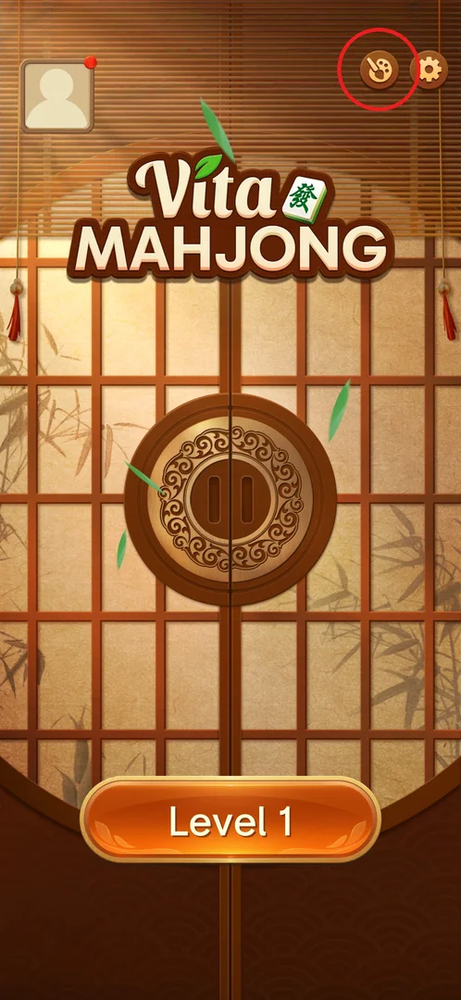
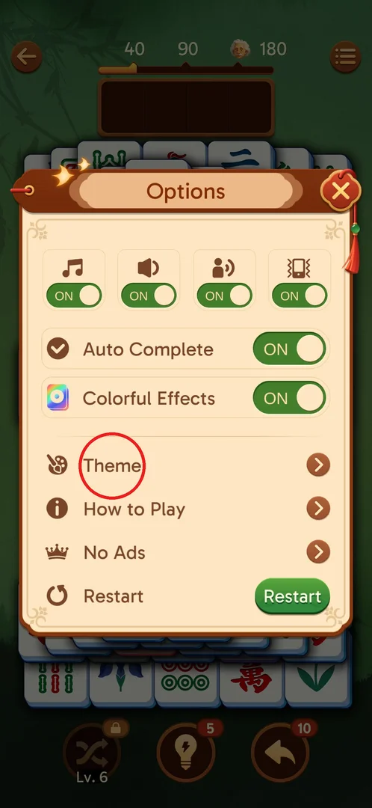
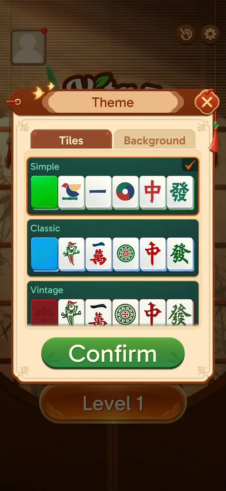
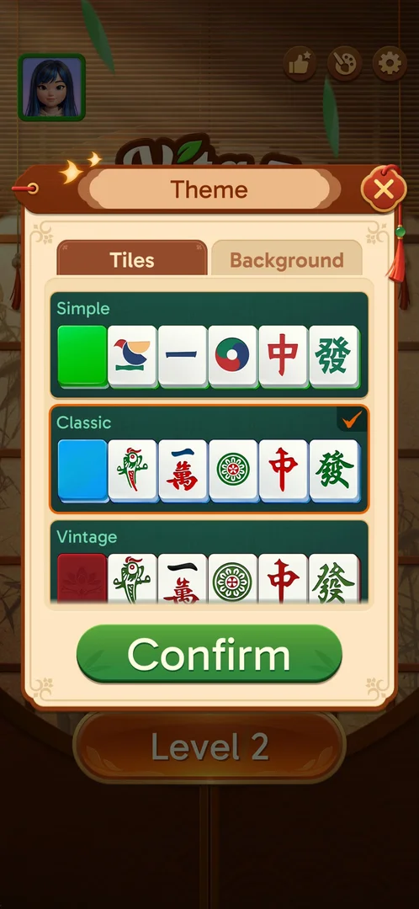
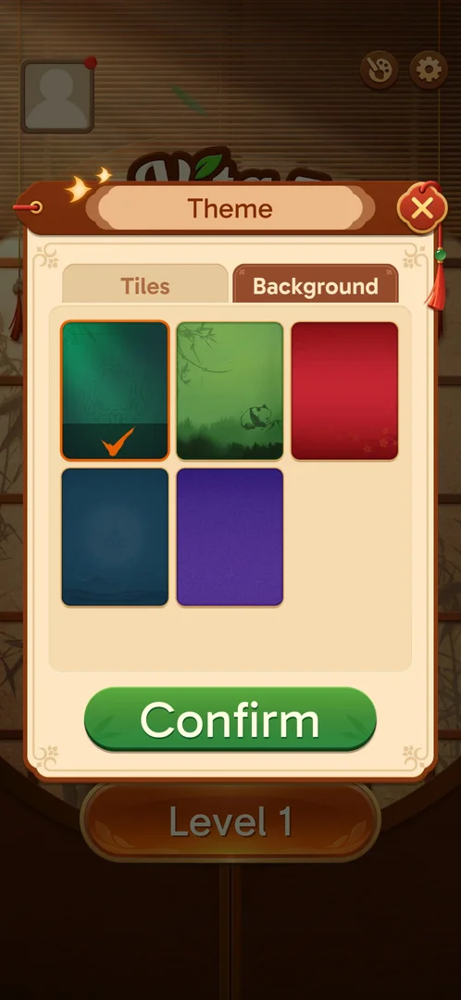
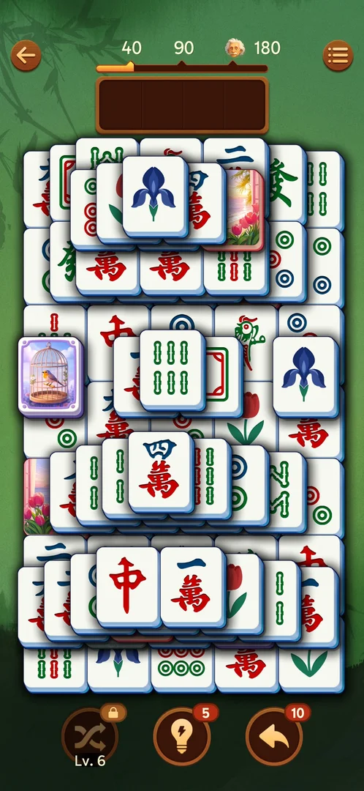

# Themes

Themes change how the game looks, not how it plays: the player picks one of three tile sets (Simple,
Classic, Vintage) and one of five board backgrounds in the Theme popup, presses Confirm, and the next
level uses them. Everything in the popup is free: no item shows a price or a lock (version 3.39.1)
[^s2] [^s3].

## Where to find it

On the main screen, tap the round palette button in the top right corner, just left of the settings
gear (the circled one). It opens the Theme popup over the main screen [^s2].

 [^s1]

Inside a level, the Options popup (the menu button in the top right of the board) has a Theme row with
the same palette icon [^s7]. The row was seen but not tapped; that it opens the same Theme popup is
inferred from its name and icon.

 [^s7]

## What it looks like

A popup titled "Theme" with a close button (red X) in its top right corner, two tabs, Tiles and
Background, and a green Confirm button at the bottom. It opens on the Tiles tab. The current choice has
an orange frame and an orange tick [^s2].

 [^s2]

## What you can do

| Tab or button | What it does |
|---|---|
| [Tiles](#tiles) | Choose the tile set: Simple, Classic or Vintage |
| [Background](#background) | Choose the board background, one of 5 |
| [Result](#result) | Confirm applies both choices; the next level shows them |

### Tiles

Three tile sets, each shown as a row of six sample tiles: Simple (green tile backs, simplified
pictures; the default on a fresh install), Classic (blue backs, traditional suits with Chinese
characters) and Vintage (red backs, traditional suits) [^s2] [^s4]. Swiping the list up did not
change the screen: there are no more sets below Vintage [^s9]. Tapping a row moves the orange frame and
tick to it; nothing changes until Confirm [^s4].

 [^s4]

### Background

Five backgrounds in a grid: dark green (the default, ticked), green with bamboo and a panda, red, dark
blue with a pagoda, and purple with clouds. None is locked or priced [^s3].

 [^s3]

### Result

Confirm closes the popup and returns to the main screen [^s10]. The choice shows in the next level:
the bamboo-and-panda background behind the level 1 board [^s6], and Classic tiles (blue sides,
traditional character suits) on the level 2 board [^s5].

 [^s6]

 [^s5]

## How it works

- 3 tile sets and 5 backgrounds, all free, nothing to unlock (version 3.39.1) [^s2] [^s3].
- The two tabs share one Confirm button; the choice applies at once, starting from the next board
  [^s5] [^s6].
- Defaults on a fresh install: Simple tiles, dark green background [^s2] [^s3].

## Cases

| Case | What was done | Result | Source |
|---|---|---|---|
| Background | Background tab → bamboo/panda → Confirm, then Level 1 | The level board has the bamboo/panda background ✅ | [^s6] |
| Tiles | Tiles tab → Classic → Confirm, then Level 2 | The board has Classic tiles at once (blue sides, traditional characters) ✅ | [^s5] |

## Not verified

- The next session's Theme popup showed Simple tiles ticked again after Classic had been confirmed
  [^s8]; why is not known (the choice not saved, or the game data reset between sessions).
- The Vintage set and the red, dark blue and purple backgrounds were not applied.
- Whether closing the popup with X (without Confirm) discards the choice.
- Whether the Options → Theme row opens the same popup (seen, not tapped).

[^s1]: session 20260930-203959-chrono-2FYKPJ, step 5 — [video at 1:28](https://youtu.be/2yK_ch59JAg?t=88)
[^s2]: session 20260930-203959-chrono-2FYKPJ, step 6 — [video at 1:39](https://youtu.be/2yK_ch59JAg?t=99)
[^s3]: session 20260930-203959-chrono-2FYKPJ, step 8 — [video at 2:00](https://youtu.be/2yK_ch59JAg?t=120)
[^s4]: session 20260930-211039-chrono-2FYKPJ, step 130
[^s5]: session 20260930-211039-chrono-2FYKPJ, step 132
[^s6]: session 20260930-203959-chrono-2FYKPJ, step 19 — [video at 3:34](https://youtu.be/2yK_ch59JAg?t=214)
[^s7]: session 20260930-211039-chrono-2FYKPJ, step 133
[^s8]: session 20260930-221457-chrono-2FYKPJ, step 7
[^s9]: session 20260930-203959-chrono-2FYKPJ, step 7 — [video at 1:51](https://youtu.be/2yK_ch59JAg?t=111)
[^s10]: session 20260930-203959-chrono-2FYKPJ, step 10 — [video at 2:17](https://youtu.be/2yK_ch59JAg?t=137)
