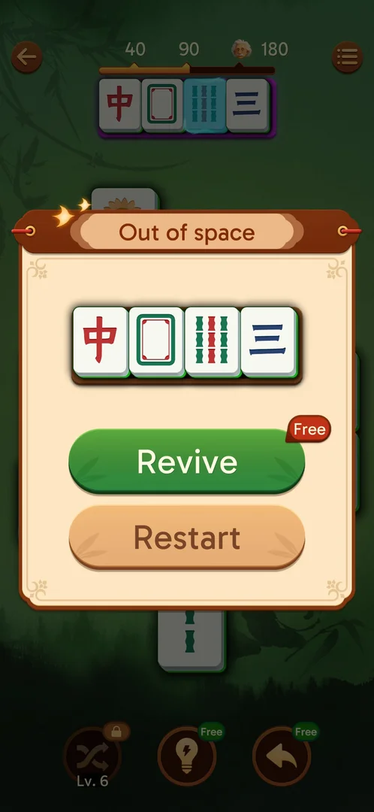

# Holding tray and Out of space

Four slots under the IQ bar. Four unmatched tiles = "Out of space" with Revive (stock), "-4 to revive"
(spends 4 Undo; hidden when Undo < 4) and Restart. Every revive puts all 4 tray tiles back on the board
[s:20260930-211039-chrono-2FYKPJ#77] [s:20260930-211039-chrono-2FYKPJ#78] [s:20260930-225122-chrono-2FYKPJ#34] [s:20260930-225122-chrono-2FYKPJ#46].

*Clip 13 s · original video not uploaded*

## Cases
| Case | What was done | Result | Source |
|---|---|---|---|
| Fill | Took 4 singles | Out of space | [s:20260930-211039-chrono-2FYKPJ#77] |
| Revive | Revive | Tray tiles back on the board | [s:20260930-211039-chrono-2FYKPJ#78] |
| Stock | Revived on L4, L6, L8, L9 | 5 → 4 → … → 0 | [s:20260930-221457-chrono-2FYKPJ#56] [s:20260930-221457-chrono-2FYKPJ#79] [s:20260930-225122-chrono-2FYKPJ#76] |
| -4 to revive | Tapped it | Undo 6 → 2, tray emptied, Revive stock kept | [s:20260930-225122-chrono-2FYKPJ#34] |
| Revive at 0 | Out of space with stock 0 | Revive with a video icon | [s:20261001-010125-chrono-2FYKPJ#35] |
