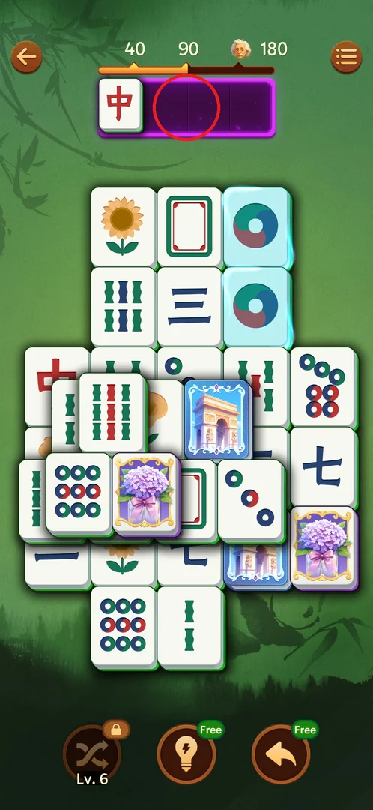
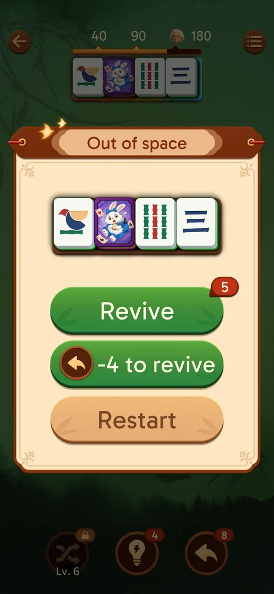
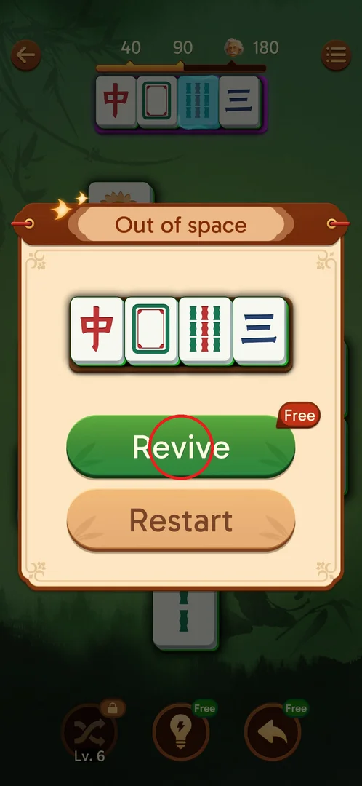
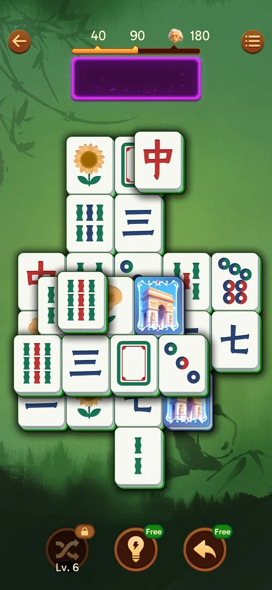
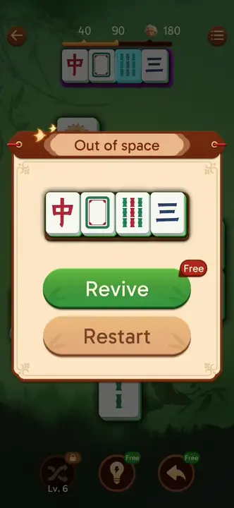
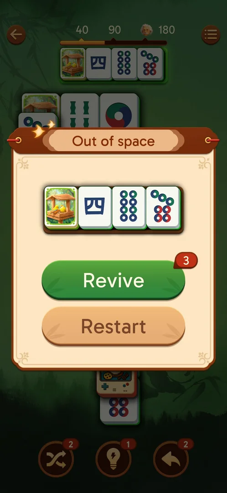
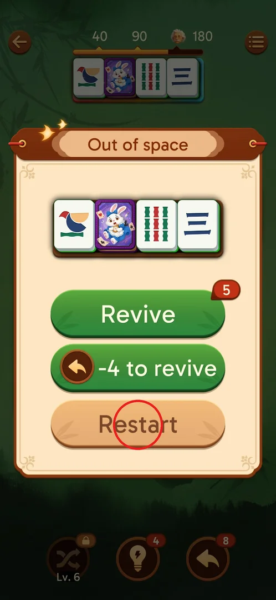

# Holding tray and Out of space

Every tile the player taps on the board goes into a holding tray of four slots at the top of the level
screen; two identical tiles in the tray vanish as a pair [^s1]. When four
tiles without a twin fill the tray, the level stops with the "Out of space" popup: the player either
revives — all four tray tiles go back to the board — or restarts the level
[^s2] [^s3].

## Where to find it

On every level screen: the tray is the wide bar of four slots right under the IQ bar (40 / 90 / 180
marks) at the top of the board [^s4]. It is not a button; it fills when
tiles are tapped. The player first took it for a combo meter until a tapped red dragon landed in its
first slot [^s4]. The "Out of space" popup has no entry of its own: it
opens by itself when the fourth unmatched tile enters the tray [^s2].

 [^s4]

## What it looks like

The tray is a dark bar with four slots; its border color follows the combo tier (green, blue, purple)
[^s1]. "Out of space" is a cream popup over the dimmed board: the title,
a copy of the four tray tiles, and up to three buttons — green **Revive** with a red stock badge, green
**-4 to revive** with an Undo icon, and beige **Restart** [^s5].

 [^s5]

## What you can do

| Tab or button | What it does |
|---|---|
| [Revive](#revive) | Spends 1 Revive (free on level 1) and puts all 4 tray tiles back on the board |
| [-4 to revive](#-4-to-revive) | Spends 4 Undo charges instead; same effect, Revive stock kept; hidden when Undo < 4 |
| [Restart](#restart) | Starts the level over |
| [Revive (video)](#revive-video) | At Revive stock 0: a rewarded ad, then the tray tiles go back to the board |

### Revive

On level 1 Revive carries a red "Free" tag and Restart is the only other button
[^s2]. From level 2 on it carries a stock badge: 5 on the first Out of
space of level 4 [^s6]. Each use spends 1: 5 on level 4, 4 on level 6,
then 3 → 2 → 1 → 0 over levels 8–9 [^s7] [^s8].
Tapping it returns all four tray tiles to their board spots; the tray is empty and the level goes on
[^s3].

 [^s2]

 [^s3]

*Clip 13 s · original video not uploaded*

### -4 to revive

The second green button shows the Undo icon and "-4 to revive" [^s5].
Tapping it spent 4 Undo charges (6 → 2), returned all four tray tiles to the board and left the Revive
stock (3) untouched [^s9]. With Undo at 2 the button is not shown at all:
only Revive and Restart [^s10].

 [^s5]

 [^s10]

### Restart

The beige button at the bottom of the popup, present in every variant seen
[^s2] [^s5] [^s11].
It was never tapped, so what it costs is not known (see Not verified).

 [^s5]

### Revive (video)

With Revive stock 0 (and Undo 0) the popup shows "Revive" with a video icon and Restart
[^s11]. Tapping it plays a rewarded ad; after the ad the tray tiles were
back on the board [^s12]. The ad seen was a playable ad with no close
button that ignored Back for over three minutes; bringing the game to the front closed it and the revive
was still granted [^s12]. See also [rewarded ads](rewarded-ads.md).

 [^s11]

## How it works

Version 3.39.1.

- The tray has 4 slots. A tapped free tile goes into it; two identical tiles in the tray vanish (IQ +5
  in the tutorial) [^s1].
- Undo takes the last tile placed in the tray back to its board spot; with an empty tray it does
  nothing [^s1].
- The fourth tile without a twin in the tray opens Out of space [^s2].
- Every revive — Revive, -4 to revive, or the video Revive — puts all four tray tiles back on the board
  [^s3] [^s9] [^s12].
- Which buttons show depends on stock: Revive "Free" on level 1; Revive with a count from level 2;
  -4 to revive only when Undo ≥ 4; Revive with a video icon at Revive 0
  [^s2] [^s6] [^s10] [^s11].
- The Revive stock is not refilled between levels 4 and 9 by anything the player saw: it only went down
  (5 → 0) [^s7] [^s8].
- Inferred from the players' notes: with one or more singles in the tray, sending uncertain tiles fills
  it fast; the level 4 and level 9 Out of space came from long batches of taps
  [^s6] [^s8].

## Cases

| Case | What was done | Result | Source |
|---|---|---|---|
| Fill | Took 4 tiles without twins (red dragon, white dragon, 8 bamboo, three) | Out of space: Revive (Free) / Restart | [^s2] |
| Revive | Tapped Revive (Free) on level 1 | All tray tiles back on their board spots, tray empty | [^s3] |
| Popup from level 2 | Out of space on level 4 | Revive (stock 5), -4 to revive, Restart | [^s6] |
| Stock | Revived on L4, L6, L8, L9 | 5 → 4 → … → 0 | [^s5] [^s7] [^s8] |
| -4 to revive | Tapped it | Undo 6 → 2, tray emptied, Revive stock kept | [^s9] |
| Undo below 4 | Out of space with Undo 2 | -4 to revive hidden | [^s10] |
| Revive at 0 | Out of space with stock 0 | Revive with a video icon | [^s11] |
| Video revive | Watched the rewarded ad | Tray tiles back on the board | [^s12] |

## Not verified

- What Restart does: whether it costs anything (lives, stock) and whether it keeps the level's time
  and IQ. Never tapped.
- How the Revive stock is refilled (rewards, shop, chests) — not seen up to level 12.
- Whether the video Revive can be used more than once per level.

[^s1]: session 20260930-211039-chrono-2FYKPJ, step 80
[^s2]: session 20260930-211039-chrono-2FYKPJ, step 77
[^s3]: session 20260930-211039-chrono-2FYKPJ, step 78
[^s4]: session 20260930-211039-chrono-2FYKPJ, step 60
[^s5]: session 20260930-221457-chrono-2FYKPJ, step 56
[^s6]: session 20260930-221457-chrono-2FYKPJ, step 60
[^s7]: session 20260930-221457-chrono-2FYKPJ, step 79
[^s8]: session 20260930-225122-chrono-2FYKPJ, step 76 — [video at 35:19](https://youtu.be/wSbzNbOhly8?t=2119)
[^s9]: session 20260930-225122-chrono-2FYKPJ, step 34 — [video at 15:11](https://youtu.be/wSbzNbOhly8?t=911)
[^s10]: session 20260930-225122-chrono-2FYKPJ, step 46 — [video at 20:00](https://youtu.be/wSbzNbOhly8?t=1200)
[^s11]: session 20261001-010125-chrono-2FYKPJ, step 35 — [video at 14:08](https://youtu.be/vc6OylgqaTw?t=848)
[^s12]: session 20261001-010125-chrono-2FYKPJ, step 43 — [video at 18:52](https://youtu.be/vc6OylgqaTw?t=1132)
