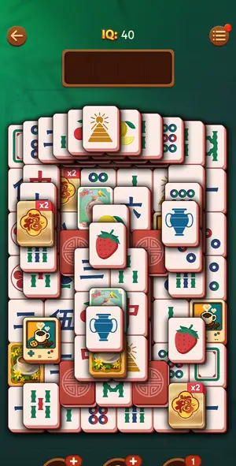
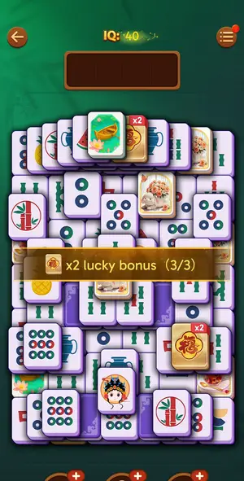

# Levels: Vita Mahjong

Every level the agents met, as its board looked at the start (the ad strips cropped). The notes tell where a new element or rule appears.

| level 19 | level 20 | level 21 look | level 22 | level 23 |
|---|---|---|---|---|
|  |  |  |  |  |

## Tries

| Level | Mechanic | Result | Time | Note |
|---|---|---|---|---|
| level 19 | core-match | 1 won, 1 lost, 3 quit | 895 s | won L19 in ~12 min: solver 38 moves then manual; 3 Hint-lit pairs the solver missed (art tiles, backs), 1 Shuffle, 1 Undo; solver misread side locks by purple backs and a 8- vs 9-circle; manual batche |
| level 20 | core-match | 1 won, 1 quit | 1048 s | Hard L20 won by hand on a 5th tile set (white faces, blue backs; solver read it as purple and saw no pair). 2 Out of space (look-alike 9- vs 7-circle; a tap at a raised tile's edge hit the raised neig |
| level 21 look | core-match | 1 won, 4 quit | 1418 s | L21 won (green set, spin ring). Solver handled flips and certain pairs but stalled twice; won by hand: one ring tile per call as the first tap, then a look; the free Shuffle opened 6 pairs at once. Ga |
| level 22 | core-match | 1 won, 2 quit | 801 s | L22 won 12.8 min. Solver missed the vase pair and the art tiles at the start (hand pairs), stalled 4x 'Hint and Shuffle at 0'; hand pairs at row ends + one Free Shuffle video at a dead end with 2 tray |
| level 23 | core-match | 1 quit | — | L23 (purple set, SPIN ring) about 15% cleared; session ended by adb 'device not found' (exit 3) on a tap. Solver read the spin ring by itself here. |
