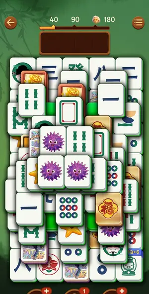
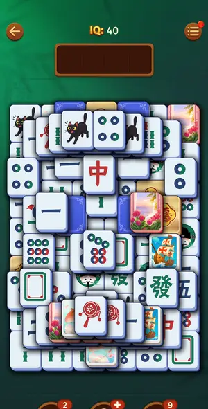
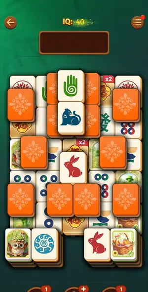

# Levels: Vita Mahjong

Every level the agents met, as its board looked at the start (the ad strips cropped). The notes tell where a new element or rule appears.

| level 19 | level 20 | level 21 look |
|---|---|---|
|  |  |  |

## Tries

| Level | Mechanic | Result | Time | Note |
|---|---|---|---|---|
| level 19 | core-match | 1 won, 1 lost, 3 quit | 895 s | won L19 in ~12 min: solver 38 moves then manual; 3 Hint-lit pairs the solver missed (art tiles, backs), 1 Shuffle, 1 Undo; solver misread side locks by purple backs and a 8- vs 9-circle; manual batche |
| level 20 | core-match | 1 won, 1 quit | 1048 s | Hard L20 won by hand on a 5th tile set (white faces, blue backs; solver read it as purple and saw no pair). 2 Out of space (look-alike 9- vs 7-circle; a tap at a raised tile's edge hit the raised neig |
| level 21 look | core-match | 3 quit | — | opened only for How to Play |
