# Levels: Vita Mahjong

Every level the agents met, as its board looked at the start (the ad strips cropped). The notes tell where a new element or rule appears.

| level 3 | level 4 | level 5 | level 6 | level 7 |
|---|---|---|---|---|
| 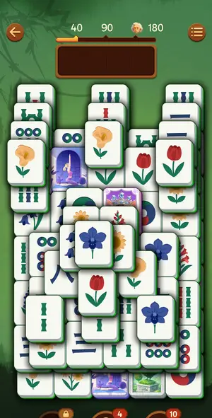 | 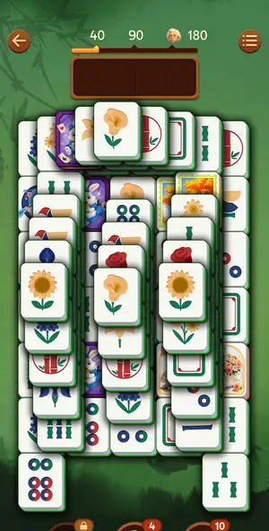 | 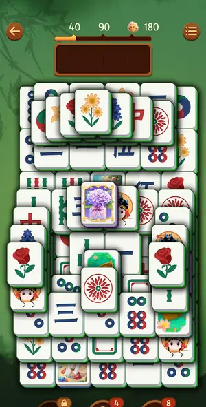 | 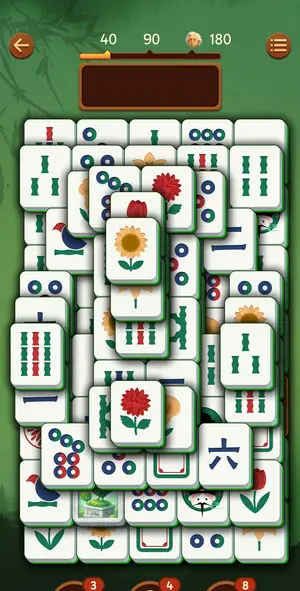 | 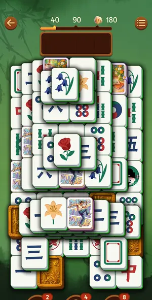 |

| level 8 | level 9 | level 10 | level 11 | level 12 |
|---|---|---|---|---|
| 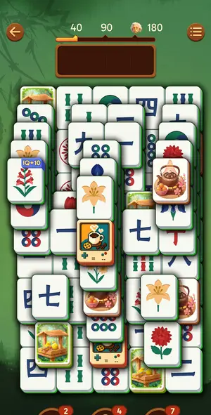 | 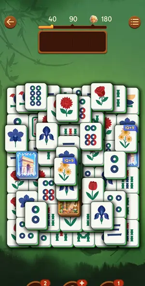 | 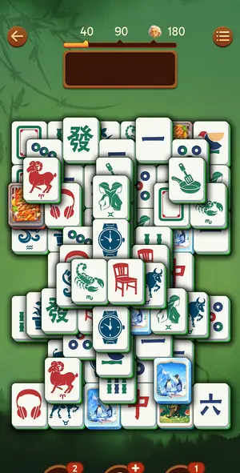 | 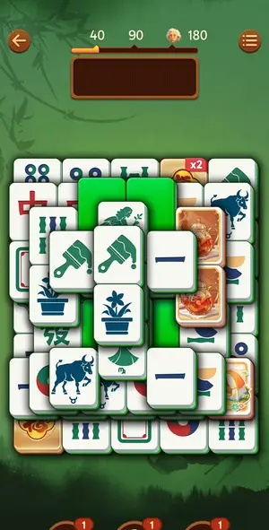 | 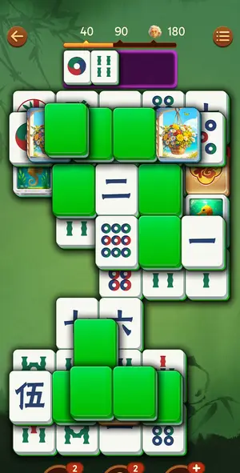 |

| level 13 | level 14 | level 15 | level 16 | level 17 |
|---|---|---|---|---|
| 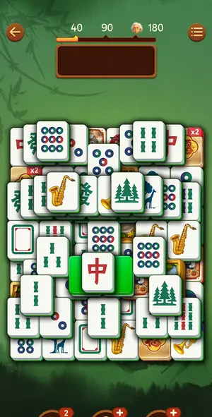 | 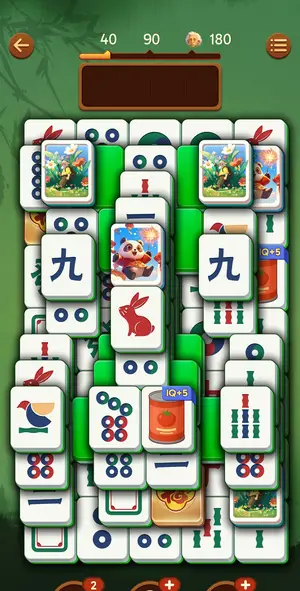 | 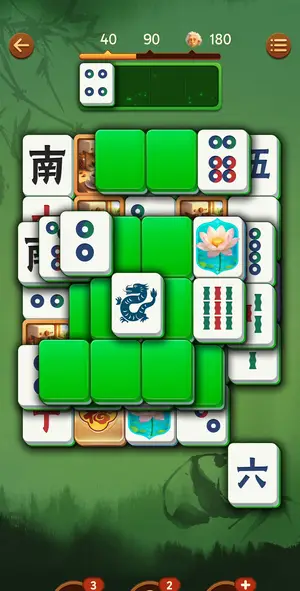 | 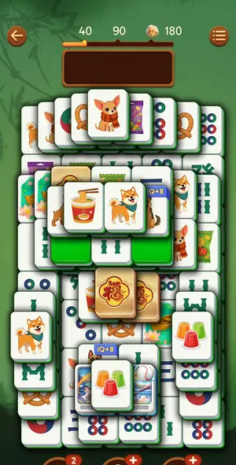 | 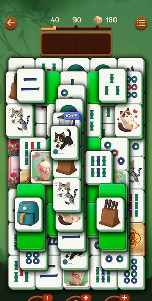 |

| level 18 | level 19 |
|---|---|
| 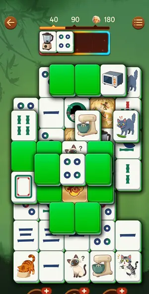 |  |

## Tries

| Level | Mechanic | Result | Time | Note |
|---|---|---|---|---|
| level 3 | core-match | 1 won | 554 s | 9 min, 28 batches, 0 hints, no Out of space. Twin pairs of free tiles in batches of 2-4 pairs worked; wrong guesses only cost a tray slot. Slow part: reading layers per frame. Next: batch 4-6 pairs pe |
| level 4 | core-match | 1 won | 449 s | 7.2 min, 20 batches, 1 Out of space (revive used), 2 undos. Cascading stacks: the lowest drawn tile of a stack is the free one. Failure: an 8-tap batch across a changing board filled the tray - keep b |
| level 5 | core-match | 1 won | 393 s | 6.3 min, 16 batches of 4-9 taps, 0 hints/undos/revives. Chains 'single to tray -> frees twin of tray tile' worked every time. Time shows a crown when it beats the best time. |
| level 6 | core-match | 1 won | 345 s | 5.5 min incl. a first-batch Out of space (intro swallowed first taps) + revive; after that 8 batches of 10-12 taps with zero misses. Big batches of certain pairs are the method. |
| level 7 | core-match | 1 won | 468 s | 7.5 min, 18 batches, 1 undo, 0 hints. Most time lost to one-tile-at-a-time top/side reads; 3 locked-guess singles filled tray to 3 once (fixed by Undo). Auto Complete never fired even with 1 tile left |
| level 8 | core-match | 1 won | 1055 s | 17.5 min: 2 Out of space (one '-4 undo' revive, one Revive), 4 hints used (stock 4->0, button now shows +). Dense 3-layer board; my layer reads were wrong about half the time: a tile drawn over the to |
| level 9 | core-match | 1 won, 1 quit | 576 s | Restarted board, 10.4 min, 16 batches, 1 Out of space (tray 3 + single) + Revive. Worked: pairs of top/edge tiles in batches of 4-10. Cost: tapping tiles whose side neighbours sit half a row offset (t |
| level 10 | core-match | 1 won | 545 s | Hard L10, 9.6 min, 12 batches, 1 undo, 1 shuffle, no Out of space. Key: side-blocking includes half-row-offset neighbours; Shuffle rearranged faces and opened 5 pairs; late batches of 8-13 chained tap |
| level 11 | core-match | 1 won | 827 s | L11 12.3 min (in-game 12:16), 1 hint, 1 shuffle, 1 undo, 0 Out of space. New: face-down green tiles flip on tap; golden x2 Elite tiles. The last ~12 tiles were finished automatically while the league  |
| level 12 | core-match | 1 won, 1 quit | 841 s | resumed at ~60%; 6 hints (2 stock + 2 videos x2) did most of the reading; free greens flip in place on 1st tap and go to tray on 2nd; ~10 min this session |
| level 13 | core-match | 1 won | 1086 s | 16.5 min incl. ~3 min of ads; first 40% in 5 batches of 8-10 certain top-layer pairs (row-end rule), last 60% slow: half-offset greens + 1 video hint pack |
| level 14 | core-match | 1 won | 749 s | L14 won ~12 min, 0 hints, 1 shuffle, never above 2 in tray. First 60% in 7 batches of 4-8 certain pairs with zero wrong taps (4 min). Slow part: last 40% with face-down greens - peeking one green per  |
| level 15 | core-match | 1 won, 1 quit | 568 s | L15 resumed ~55%: 9.2 min, 2 hints (taps ate both before I saw them), 1 shuffle. Fast part: reveal-one-green-then-act loop: end every batch with ONE green reveal (flips in place, no tray slot), next b |
| level 16 | core-match | 1 won | 843 s | L16 13.7 min, 1 shuffle, 0 hints. Face-up first 60% in 6 batches (4 min). Slow part: hidden tiles appearing as the board opens, ~1 reveal per frame. Free greens sometimes went STRAIGHT into the tray o |
| level 17 | core-match | 1 won, 1 quit | 861 s | L17 restarted from scratch on launch (the half-played board was not kept). 13.9 min, ~38 decisions. Fast parts: 4-6 tap batches of certain pairs; flipping free greens costs no tray slot, and a seen gr |
| level 18 | core-match | 1 won, 2 quit | 1406 s | L18 resumed at ~45% with tray blender+4-circle. One tap per call with 1.3-2 s waits: no lag errors. Flipped free greens for info (no tray cost); a tile tapped while its twin green is face-up pairs at  |
| level 19 | core-match | 1 quit | — | L19 dense; solver stops after 3 rounds (no certain pair, flips none); blank-card tiles (red-bordered cards) are real tiles: the hint pointed at a pair of them, tap both |
